# EXECUTIVE SUMMARY

This report presents the work carried out during my internship as part of the MSc Big Data Analytics program. The project I was assigned involved building a Human Resource Management System (HRMS) that uses artificial intelligence — specifically, deep learning-based face recognition — to automate employee attendance tracking. The goal was to create a system where employees could simply look at their mobile phone camera, and the system would identify them and record their attendance without any physical interaction.

Traditional attendance methods such as paper registers, RFID swipe cards, and fingerprint scanners have served organizations for years, but they come with well-known problems. Manual registers are easy to manipulate. RFID cards can be shared or lost. Fingerprint scanners require physical contact, which became a significant concern after the COVID-19 pandemic. Perhaps most importantly, none of these systems provide any analytical value — they simply record timestamps without offering insights into workforce patterns.

The system I developed addresses all of these problems. At its core, it uses the InspireFace library with the Megatron model — a production-grade face recognition engine based on the ArcFace framework. ArcFace is a training methodology that uses an additive angular margin loss function to teach a deep Convolutional Neural Network (specifically, ResNet-50) to produce highly discriminative face representations. Each face is converted into a 512-dimensional numerical vector called an embedding. These embeddings serve as compact mathematical fingerprints of each person's face.

When an employee wants to mark attendance, the system captures their face through the phone camera, extracts a live 512-D embedding, and compares it against all stored employee embeddings using cosine similarity. If the similarity score exceeds a configurable threshold (set at 0.6 by default), the identity is confirmed and attendance is logged with a timestamp and confidence score.

A key design principle of this system is privacy. No face images are ever stored in the database. After the AI model processes an image and extracts the embedding, the original image is discarded from memory. Only the 512-dimensional vector (2,048 bytes of floating-point numbers) is retained. These vectors are mathematically irreversible — it is impossible to reconstruct a recognisable face from them.

The complete system consists of three layers: a mobile HTML5 client for employees, a React.js admin dashboard for HR managers, and a FastAPI Python backend that handles AI processing, database operations, and analytics. The database is SQLite with SQLAlchemy ORM. The analytics module provides attendance trend analysis, department-wise performance comparison, and automated monthly payroll computation based on attendance records.

From an MSc Big Data Analytics perspective, this project brings together deep learning (ResNet-50 architecture, ArcFace loss function), computer vision (face detection, image preprocessing), data analytics (attendance trend analysis, department metrics, payroll computation), database design (relational schema with BLOB storage for embeddings), and software engineering (REST APIs, client-server architecture). It demonstrates how AI and data analytics can be applied together to solve a practical enterprise problem.

The system achieves face recognition in under 2 seconds on standard hardware (CPU, no GPU required), supports hundreds of employees, and is built entirely on open-source technologies with zero licensing costs.

---

<div style="page-break-after: always;"></div>

# TABLE OF CONTENTS

| Sr. No. | Title | Page No. |
|---------|-------|----------|
| | Executive Summary | i-ii |
| | Table of Contents | iii-iv |
| | List of Figures | v |
| | List of Tables | vi |
| **1** | **Chapter 1: Introduction** | **1** |
| 1.1 | About the Industry/Organization | 1 |
| 1.2 | About the Department/Course | 4 |
| 1.3 | About the Project | 7 |
| **2** | **Chapter 2: Statement of Problems, System Study, System Analysis, System Design, Application and Utility** | **11** |
| 2.1 | Statement of Problems | 11 |
| 2.2 | System Study | 14 |
| 2.3 | System Analysis | 16 |
| 2.4 | System Design | 19 |
| 2.5 | Application and Utility | 23 |
| **3** | **Chapter 3: Methodology and Technical Background** | **25** |
| 3.1 | Overview of Methodology | 25 |
| 3.2 | Deep Learning Fundamentals | 26 |
| 3.3 | Convolutional Neural Networks | 28 |
| 3.4 | ResNet-50 Architecture | 30 |
| 3.5 | ArcFace Loss Function | 32 |
| 3.6 | InspireFace Engine | 34 |
| 3.7 | Embedding Generation and Matching | 36 |
| 3.8 | Technology Stack Details | 38 |
| **4** | **Chapter 4: Details of Analysis** | **40** |
| 4.1 | Data Flow Analysis | 40 |
| 4.2 | Embedding Quality Analysis | 42 |
| 4.3 | Threshold Sensitivity Analysis | 44 |
| 4.4 | Performance Benchmarks | 46 |
| 4.5 | Analytics and Reporting | 47 |
| 4.6 | Security and Privacy Analysis | 49 |
| **5** | **Chapter 5: Main Findings and Recommendations** | **51** |
| 5.1 | Key Findings | 51 |
| 5.2 | Recommendations | 53 |
| **6** | **Conclusion and Future Enhancements** | **55** |
| 6.1 | Conclusion | 55 |
| 6.2 | Future Enhancements | 57 |
| **7** | **References and Annexure** | **58** |
| 7.1 | References | 58 |
| 7.2 | Annexure — Sample Screenshots | 60 |

---

## List of Figures

| Figure No. | Title | Page No. |
|------------|-------|----------|
| Figure 1.1 | Three-Tier System Architecture | 8 |
| Figure 1.2 | System Deployment Diagram | 10 |
| Figure 2.1 | System Workflow — Registration and Check-In | 15 |
| Figure 2.2 | Use Case Diagram | 17 |
| Figure 2.3 | Entity-Relationship Diagram | 20 |
| Figure 2.4 | Employee Registration Flowchart | 21 |
| Figure 2.5 | Attendance Check-In Flowchart | 22 |
| Figure 3.1 | CNN Feature Extraction Pipeline | 29 |
| Figure 3.2 | ResNet-50 Residual Block | 31 |
| Figure 3.3 | ArcFace Training Mechanism | 33 |
| Figure 3.4 | Face Detection to Embedding Pipeline | 36 |
| Figure 3.5 | Cosine Similarity — Geometric View | 37 |
| Figure 4.1 | Data Flow Diagram — Level 0 | 40 |
| Figure 4.2 | Data Flow Diagram — Level 1 | 41 |
| Figure 4.3 | FAR vs FRR Trade-off Chart | 45 |
| Figure A.1–A.8 | Sample Screenshots | 60-63 |

## List of Tables

| Table No. | Title | Page No. |
|-----------|-------|----------|
| Table 1.1 | Project Alignment with MSc BDA Curriculum | 6 |
| Table 1.2 | Technology Stack | 9 |
| Table 2.1 | Comparison of Attendance Methods | 12 |
| Table 2.2 | Functional Requirements Specification | 18 |
| Table 2.3 | Non-Functional Requirements Specification | 18 |
| Table 2.4 | Database Tables Overview | 20 |
| Table 2.5 | REST API Endpoint Summary | 23 |
| Table 3.1 | ResNet-50 Layer Configuration | 31 |
| Table 3.2 | Comparison of Face Recognition Loss Functions | 33 |
| Table 4.1 | Data Transformation at Each Pipeline Stage | 42 |
| Table 4.2 | Embedding Similarity Score Observations | 43 |
| Table 4.3 | Threshold Impact on FAR and FRR | 44 |
| Table 4.4 | System Performance Benchmarks | 46 |
| Table 5.1 | Summary of Key Findings | 52 |

---

<div style="page-break-after: always;"></div>

# CHAPTER 1: INTRODUCTION

## 1.1 About the Industry/Organization

### 1.1.1 Organization Overview

**[Organization Name]** is a technology company that develops software solutions for businesses across different industries. Their primary areas of work include enterprise software development, Human Resource Technology (HRTech), and data analytics platforms. The company was established in **[Year]** and is headquartered in **[City, State]**, with a team of approximately **[Number]** employees working across software engineering, data science, and product design.

What attracted me to this organization for my internship was their active investment in AI and machine learning. Unlike many companies that use AI as a marketing buzzword, this organization was genuinely building products around it — from document processing systems to computer vision applications. They had the infrastructure, the datasets, and most importantly, the mentorship to support a meaningful learning experience.

The organization follows an agile development methodology, working in two-week sprints with regular code reviews, stand-ups, and retrospective sessions. As an intern, I was embedded directly within the AI and Data Analytics team, participating in all of these activities alongside full-time engineers.

### 1.1.2 The HRTech Industry

Human Resource Technology has become one of the fastest-growing segments of the enterprise software market. According to a report by Grand View Research, the global HRTech market was valued at approximately USD 24 billion in 2023 and is projected to reach USD 39.9 billion by 2029, growing at a compound annual growth rate (CAGR) of 7.5%.

Several forces are driving this growth:

**Automation of Routine Tasks:** Organizations are increasingly automating repetitive HR tasks — onboarding paperwork, leave management, attendance tracking, and salary processing. The objective is to free up HR professionals to focus on strategic activities like talent management and employee engagement.

**AI-Driven Decision Making:** Modern HR departments are expected to provide data-driven recommendations to management. This includes workforce analytics, attrition prediction, performance benchmarking, and compensation analysis. Machine learning models trained on historical HR data are enabling this shift from intuition-based to data-based HR.

**Touchless Biometric Systems:** The COVID-19 pandemic was a turning point for biometric attendance systems. Traditional fingerprint scanners, which require direct skin contact, were suddenly seen as hygiene risks. This accelerated the adoption of contactless alternatives, particularly face recognition. Organizations that had never considered biometric attendance before started actively evaluating face recognition solutions.

**Cloud and Mobile-First Architecture:** The shift to remote and hybrid work models has pushed HR systems to be accessible from anywhere. Cloud-based HR platforms and mobile-first designs have become standard expectations rather than premium features.

### 1.1.3 My Role and Responsibilities

During the internship period, I was given the responsibility of designing and building an AI-powered attendance management system. My specific responsibilities included:

1. **Research and Model Selection** — Evaluating different face recognition libraries (InsightFace, dlib, InspireFace) and selecting the most suitable one based on accuracy, ease of integration, and documentation quality.

2. **AI Pipeline Development** — Building the complete face recognition pipeline from image capture to identity verification, including face detection, embedding extraction, L2 normalisation, and cosine similarity matching.

3. **Backend Development** — Writing the REST API backend in Python using FastAPI, including all endpoints for employee management, attendance tracking, payroll generation, and analytics.

4. **Database Design** — Designing and implementing the relational database schema using SQLAlchemy ORM with SQLite, with particular attention to the efficient storage of 512-dimensional face embeddings as binary BLOBs.

5. **Frontend Development** — Building the mobile HTML5 interface for employee registration and attendance, and contributing to the React.js admin dashboard.

6. **Analytics Implementation** — Developing the analytics module that transforms raw attendance data into trend charts, department comparisons, and payroll calculations.

7. **Testing and Documentation** — Testing the system with multiple users, tuning the recognition threshold, and documenting the entire project for academic submission.

---

## 1.2 About the Department/Course

### 1.2.1 MSc Big Data Analytics — Program Overview

I am currently pursuing a Master of Science (MSc) in Big Data Analytics from **[University Name]**, affiliated with **[College Name]**. This is a two-year postgraduate program designed to produce graduates who can work at the intersection of statistics, computer science, and domain expertise — the so-called "data science triangle."

The program is structured across four semesters:

**Semester 1 & 2 — Foundation:** Courses in Statistical Methods, Python Programming, Database Management Systems, Data Structures, and Introduction to Machine Learning. These semesters build the mathematical and programming foundation needed for advanced work.

**Semester 3 — Advanced Topics:** Courses in Deep Learning, Big Data Technologies (Hadoop, Spark, MapReduce), Natural Language Processing, Computer Vision, and Data Visualisation. This is where we got hands-on with neural networks, CNNs, and distributed computing frameworks.

**Semester 4 — Internship and Project:** The final semester is entirely dedicated to an industry internship where students apply their accumulated knowledge to a real-world project. This report is the outcome of that internship.

### 1.2.2 Core Subjects Relevant to This Project

Several courses from the program directly contributed to my ability to execute this project:

**Machine Learning:** This course covered supervised and unsupervised learning algorithms, loss functions, gradient descent, and model evaluation metrics. The concept of loss functions was particularly relevant — understanding how ArcFace modifies the standard softmax loss to create better face embeddings was the theoretical foundation for this project.

**Deep Learning:** This course introduced neural network architectures including feedforward networks, CNNs, RNNs, and autoencoders. We implemented basic CNNs for image classification using Keras and TensorFlow. This background was essential for understanding the ResNet-50 architecture used in the face recognition model.

**Computer Vision:** We studied image processing fundamentals — convolution operations, edge detection, feature extraction (SIFT, HOG), and face detection algorithms. This course gave me the vocabulary and conceptual framework to understand what the InspireFace engine was doing internally.

**Database Management Systems:** We covered relational database design, normalisation, SQL, and the basics of NoSQL databases. The database schema design for this project (particularly the decision to store embeddings as BLOBs) drew directly on these concepts.

**Data Visualisation:** We worked with charting libraries and dashboard design principles. The Recharts-based analytics dashboard in the admin panel is a direct application of what we learned.

### 1.2.3 How This Project Maps to the Curriculum

The following table shows the direct connection between what I studied and what I implemented:

**Table 1.1: Project Alignment with MSc Big Data Analytics Curriculum**

| Course Module | What We Studied | How I Applied It in This Project |
|---|---|---|
| Machine Learning | Loss functions, model training, gradient descent | ArcFace loss function analysis, understanding how the model learns discriminative embeddings |
| Deep Learning | CNNs, ResNet, backpropagation, activation functions | ResNet-50 backbone architecture for face embedding extraction |
| Computer Vision | Face detection, image preprocessing, feature extraction | InspireFace face detection pipeline, OpenCV image preprocessing |
| Big Data Technologies | Hadoop, Spark, distributed processing | Analytical query patterns designed for scalability; though SQLite is used now, the queries translate directly to Spark SQL |
| Database Systems | Relational design, SQL, normalisation, indexing | SQLAlchemy ORM models, BLOB storage for embeddings, query design |
| Data Visualisation | Charts, dashboards, visual encoding | Recharts-based admin dashboard with bar charts, line charts, stats cards |
| Python Programming | NumPy, pandas, data manipulation | NumPy for vector operations (L2 norm, dot product), OpenCV for image processing |
| Statistics | Probability, distributions, hypothesis testing | Understanding False Acceptance Rate and False Rejection Rate curves; threshold selection based on Equal Error Rate |

### 1.2.4 Learning Objectives for the Internship

The university defines specific learning objectives that the internship must address:

1. **LO1:** Apply machine learning and deep learning techniques to solve a real-world problem (achieved through ArcFace/ResNet-50 face recognition implementation).

2. **LO2:** Design and implement data pipelines that transform raw data into actionable insights (achieved through the image-to-embedding-to-attendance pipeline and the analytics dashboard).

3. **LO3:** Demonstrate competency in database design and management (achieved through the SQLAlchemy ORM schema with BLOB storage and SQLite backend).

4. **LO4:** Build scalable, maintainable software systems using modern frameworks (achieved through the FastAPI + React.js + SQLite architecture).

5. **LO5:** Apply ethical considerations to data handling, particularly for sensitive data (achieved through privacy-by-design approach — no image storage, embedding-only retention).

---

## 1.3 About the Project

### 1.3.1 Project Title

**AI-Powered Face Recognition System for Human Resource Management**

### 1.3.2 Project Description

The aim of this project was to build a complete Human Resource Management System (HRMS) that uses AI-based face recognition for automated employee attendance tracking. The system is designed for small to medium enterprises (SMEs) with 50 to 500 employees.

In simple terms, here is what the system does: when an employee wants to mark their attendance, they open a web page on their mobile phone, the phone camera captures their face, the image is sent to a backend server over an encrypted connection, the server runs the image through a deep learning model that converts the face into a 512-dimensional numerical vector, this vector is compared against all stored employee vectors using cosine similarity, and if a match is found above the confidence threshold, the attendance is automatically logged with a timestamp.

But the system is more than just an attendance clock. It is a full HRMS with:

- **Employee Management** — HR administrators can add, view, edit, and delete employee records through the dashboard.
- **Department Management** — Employees are organised into departments for reporting purposes.
- **Attendance History** — Complete attendance logs with date/time stamps, confidence scores, and filtering by date range and department.
- **Payroll Computation** — The system calculates monthly salaries based on the number of days an employee was present, multiplied by their per-day salary rate.
- **Analytics Dashboard** — Interactive charts showing attendance trends over time, department-wise attendance rates, and summary statistics.

### 1.3.3 Architecture Overview

The system follows a standard three-tier architecture, which is the industry-standard pattern for web applications:

**Figure 1.1: Three-Tier System Architecture**

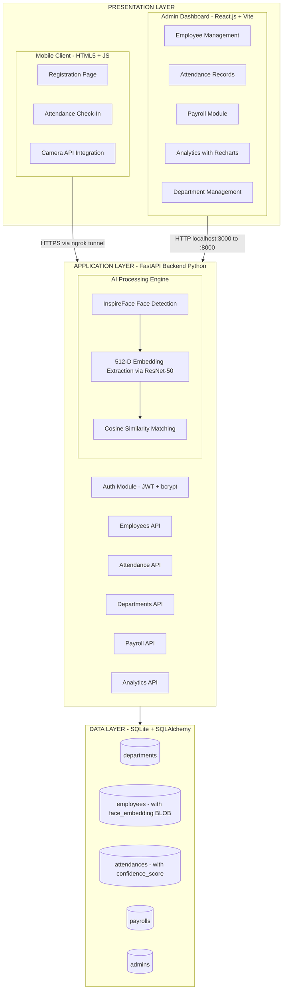

**Layer 1 — Presentation Layer:** This is the user-facing part of the system. There are two distinct interfaces:

- The **mobile client** is a set of simple HTML5 pages (no framework, just vanilla JavaScript) that employees access from their phone browsers. The registration page has a form for entering personal details plus a camera button for capturing their face. The attendance page has a single "Check In" button that triggers the camera, captures the face, and sends it to the backend.

- The **admin dashboard** is a more sophisticated single-page application built with React.js 18 and Vite (the build tool). It has multiple sections — employee listing, attendance history with filters, payroll calculation, and an analytics section with interactive charts powered by the Recharts library.

**Layer 2 — Application Layer:** The entire backend is a single FastAPI application. FastAPI was chosen because it supports asynchronous request handling (important when multiple employees check in simultaneously), has built-in request validation via Pydantic models, and auto-generates interactive API documentation (Swagger UI) at the /docs endpoint.

The AI engine is a module within this layer. It uses the InspireFace library to perform face detection (locating the face in the image) and feature extraction (converting the face into a 512-dimensional embedding). The matching logic compares the live embedding against stored embeddings using cosine similarity.

**Layer 3 — Data Layer:** All persistent data is stored in a SQLite database (file: `hrms.db`). SQLAlchemy provides the Object-Relational Mapping (ORM), so database interactions are done through Python objects rather than raw SQL strings. The five tables store departments, employees (with face embeddings as BLOBs), attendance records, payroll data, and admin credentials.

### 1.3.4 Technology Stack

**Table 1.2: Technology Stack**

| Component | Technology | Version | Purpose |
|---|---|---|---|
| Backend Framework | FastAPI | Latest | Async Python web framework with auto-generated API docs |
| AI/ML Engine | InspireFace | Latest | Face detection and 512-D embedding extraction |
| AI Model | Megatron (ArcFace + ResNet-50) | - | Pre-trained deep CNN for face recognition |
| Fallback Detection | OpenCV Haar Cascade | 4.x | Backup face detection when InspireFace unavailable |
| Database | SQLite | 3.x | Lightweight relational database, no server needed |
| ORM | SQLAlchemy | Latest | Python Object-Relational Mapping |
| Admin Frontend | React.js + Vite | 18.x | Single-page application for HR dashboard |
| Analytics Charts | Recharts | Latest | React charting library for data visualisation |
| Mobile Frontend | HTML5 + Vanilla JavaScript | - | Simple web pages for employee interaction |
| Image Processing | OpenCV (cv2) | 4.x | Image decoding, colour conversion, preprocessing |
| Vector Operations | NumPy | Latest | L2 normalisation, dot products, array operations |
| Authentication | JWT via python-jose | Latest | JSON Web Token generation and verification |
| Password Security | bcrypt | Latest | One-way password hashing with salt |
| Network Tunnel | ngrok | Latest | HTTPS tunnel for mobile phone access |
| CORS | FastAPI CORSMiddleware | Built-in | Cross-Origin Resource Sharing for frontend access |

### 1.3.5 System Deployment Architecture

**Figure 1.2: System Deployment Diagram**

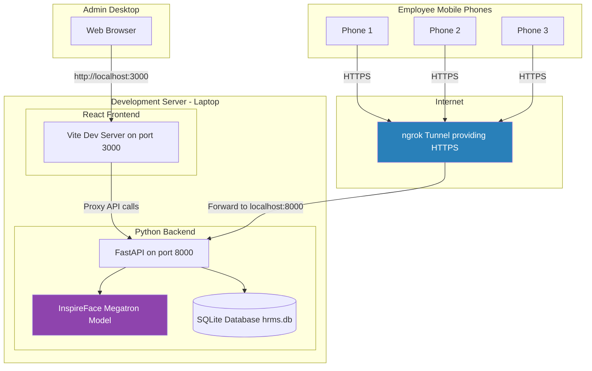

### 1.3.6 Scope of the Project

The scope of this project can be summarised in five areas:

1. **AI/ML Pipeline** — Design and implementation of the face recognition pipeline including face detection, embedding extraction, normalisation, and cosine similarity matching targeting 512-D vector space operations.

2. **Backend System** — RESTful API development using FastAPI covering employee management, attendance tracking, payroll processing, analytics, and department management with JWT authentication.

3. **Database Design** — Relational schema design with five tables, implementing BLOB storage for binary embedding data, and query patterns for analytics aggregation.

4. **Frontend Development** — React.js admin dashboard with Recharts analytics and HTML5 mobile client with camera API integration.

5. **Analytics Module** — Attendance trend analysis, department-wise comparison, automated payroll computation, and dashboard statistics — demonstrating Big Data Analytics concepts in an HR context.

---

<div style="page-break-after: always;"></div>

# CHAPTER 2: STATEMENT OF PROBLEMS, SYSTEM STUDY, SYSTEM ANALYSIS, SYSTEM DESIGN, APPLICATION AND UTILITY

## 2.1 Statement of Problems

### 2.1.1 The State of Attendance Management

Employee attendance management is one of the most fundamental HR functions in any organization. Accurate attendance records directly impact payroll processing, performance evaluation, compliance reporting, and workforce planning. Despite its importance, most organizations still rely on methods that were designed decades ago and have not kept up with technological advances.

During my research at the start of the internship, I identified five major problems with existing attendance systems. These problems are not hypothetical — they are well-documented in both academic literature and industry surveys.

### 2.1.2 Problem 1: Buddy Punching and Proxy Attendance

Buddy punching refers to the practice where one employee marks attendance on behalf of another who is not actually present. This is the single most common form of attendance fraud and affects all non-biometric systems.

With manual registers, it is trivially easy — one person signs for another. With RFID swipe cards, an employee simply hands their card to a colleague. Even basic biometric systems have been circumvented — there are documented cases of silicone fingerprint replicas being used to fool fingerprint scanners.

The American Payroll Association estimates that buddy punching costs U.S. employers approximately USD 373 million per year in unearned wages. For individual companies, this translates to an average of 2-5% payroll inflation.

A face recognition system addresses this directly, because the biometric being verified (the face) cannot be easily detached from the person or shared with someone else.

### 2.1.3 Problem 2: Hardware Costs and Maintenance

Traditional biometric systems require dedicated hardware at each attendance point. A mid-range fingerprint scanner costs between INR 15,000 to INR 50,000 per unit. An RFID reader system costs INR 10,000 to INR 30,000 per unit. For an organization with multiple floors, branches, or entry points, these costs multiply quickly.

Beyond the initial purchase, there are ongoing maintenance costs — device calibration, sensor cleaning, software updates, network connectivity, and replacement of malfunctioning units. Many organizations report spending 15-20% of the initial hardware cost annually on maintenance.

Our system eliminates this entirely. The "hardware" is the employee's own mobile phone, which they already own. The "server" is a standard laptop or desktop computer running Python. There is zero additional hardware investment.

### 2.1.4 Problem 3: Hygiene Concerns (Post-COVID)

The COVID-19 pandemic fundamentally changed how people think about shared surfaces. Fingerprint scanners require direct skin contact from every employee, multiple times per day. In a company with 200 employees, the scanner surface is touched 400+ times daily — a significant vector for disease transmission.

Even before COVID-19, there were hygiene concerns about fingerprint scanners in certain environments (hospitals, food processing facilities, clean rooms). The pandemic merely accelerated a trend that was already underway.

Face recognition is inherently contactless. The employee never touches any shared device — they simply look at their own phone camera. This makes it suitable for hygiene-sensitive environments and pandemic-era workplace requirements.

### 2.1.5 Problem 4: Lack of Analytical Capabilities

Perhaps the most overlooked problem with traditional attendance systems is their inability to provide analytical insights. A paper register records names and timestamps. A fingerprint scanner logs entries and exits. But neither system tells management anything about patterns, trends, or anomalies.

Questions like "Which department has the lowest attendance rate this quarter?" or "Is absenteeism increasing on Mondays?" or "How does attendance correlate with project deadlines?" cannot be answered by traditional systems without manual data collection and analysis.

For an MSc Big Data Analytics student, this gap was particularly striking. Attendance data is inherently structured, time-series data — exactly the kind of data that analytics pipelines are designed to process. The problem is not the data; it is that traditional systems were never designed to analyse it.

### 2.1.6 Problem 5: Scalability Limitations

Scaling a hardware-based attendance system means buying more hardware. Opening a new branch means installing new scanners, configuring new network connections, and potentially purchasing additional software licences. For growing businesses, this creates a significant barrier.

Our system scales horizontally with essentially zero marginal cost. A new branch just needs an internet connection and a mobile phone — the employees connect to the same backend server through ngrok or a cloud deployment.

### 2.1.7 Comparison of Attendance Methods

**Table 2.1: Comparison of Attendance Methods**

| Feature | Manual Register | RFID Card | Fingerprint Scanner | Face Recognition (Our System) |
|---|---|---|---|---|
| Prevents Buddy Punching | No | No | Partially | Yes |
| Contactless | Yes | Yes | No | Yes |
| Hardware Cost Per Point | Nil | INR 10-30K | INR 15-50K | Nil (uses employee's phone) |
| Ongoing Maintenance | Nil | Low | High | Minimal |
| Scalability | Poor | Moderate | Poor | Excellent |
| Built-in Analytics | No | No | No | Yes |
| Privacy Protection | N/A | N/A | Low (fingerprint stored) | High (only embeddings stored) |
| Remote Check-In | Not possible | Not possible | Not possible | Possible (via internet) |
| COVID-Safe | Yes | Yes | No | Yes |

### 2.1.8 Problem Statement

Based on the analysis above, the problem statement for this project was formulated as:

*"To design and develop an AI-powered, touchless, and privacy-preserving attendance management system using deep learning-based face recognition that: (1) prevents proxy attendance, (2) eliminates the need for dedicated biometric hardware, (3) provides contactless operation, (4) integrates analytical capabilities for HR decision-making, (5) scales efficiently across locations, and (6) stores only mathematical embedding vectors instead of raw biometric images to ensure employee privacy."*

---

## 2.2 System Study

### 2.2.1 Study of Existing Solutions

Before writing any code, I spent two weeks studying the existing landscape of face recognition attendance systems. This involved reviewing commercial products, cloud-based APIs, and open-source implementations. The goal was to understand what was already available and identify gaps that our system could address.

**Commercial Products (ZKTeco, TensorGo, Face++):**
These are enterprise-grade solutions that offer high accuracy and comprehensive features. However, they come with significant costs — both in terms of hardware (dedicated face recognition terminals) and software (annual licensing fees). A basic ZKTeco face recognition terminal costs INR 25,000-80,000 per unit, and enterprise software licenses can run into lakhs per year. For small and medium businesses with tight budgets, these solutions are often out of reach.

**Cloud-Based APIs (AWS Rekognition, Azure Face API, Google Cloud Vision):**
Cloud APIs offer high accuracy without requiring on-premise hardware. However, they have three drawbacks: (1) Data sovereignty — employee face images are sent to third-party servers, often located outside India, raising compliance concerns. (2) Per-request pricing — AWS Rekognition charges approximately USD 0.001 per face comparison. For a company with 200 employees checking in daily, that is 6,000 requests per month, plus gallery storage costs. (3) Internet dependency — if the internet connection drops, attendance cannot be recorded.

**Open-Source Projects:**
I reviewed several GitHub repositories that implement face recognition. Most were proof-of-concept projects that worked in demo settings but lacked production essentials: proper error handling, database integration, user authentication, analytics, and documentation. Many stored raw face images in the filesystem, which is a privacy concern.

### 2.2.2 Key Differentiators of Our System

Our system fills the gaps identified in the study:

1. **On-Premise AI Processing** — The InspireFace model runs entirely on the organization's own server. No employee biometric data leaves the premises. This addresses data sovereignty concerns and eliminates internet dependency for AI processing.

2. **Zero Hardware Investment** — Employees use their existing mobile phones as biometric capture devices. The backend runs on any standard computer. There are no dedicated terminals, scanners, or readers to purchase.

3. **Privacy by Design** — The system stores only 512-dimensional embedding vectors (2,048 bytes per employee), not face images. These vectors are mathematically irreversible — the original face cannot be reconstructed from them. This is a fundamental architectural decision, not an add-on feature.

4. **Integrated Analytics** — Attendance data feeds directly into trend analysis charts, department comparison metrics, and automated payroll calculations. The system is not just a clock-in tool; it is an analytics platform.

5. **Open-Source Stack** — Every component (InspireFace, FastAPI, React, SQLite, OpenCV, NumPy) is free and open-source. There are zero licensing costs, and the code can be audited, modified, and extended.

6. **Fallback Mechanism** — If the InspireFace model fails to load (e.g., missing model files on a new deployment), the system automatically falls back to OpenCV Haar Cascade face detection. This ensures the system remains operational, though with reduced accuracy.

**Figure 2.1: System Workflow — Registration and Attendance**

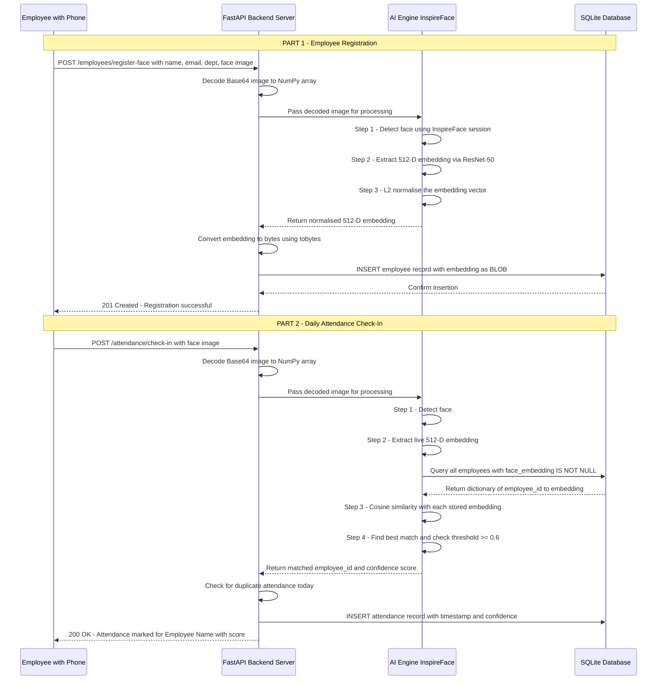

---

## 2.3 System Analysis

### 2.3.1 Functional Requirements

Through discussions with my industry mentor and by studying what HR departments actually need in their daily operations, I identified ten functional requirements for the system. These are listed in order of priority.

**Table 2.2: Functional Requirements Specification**

| Req. ID | Requirement Description | Module | Priority |
|---|---|---|---|
| FR-01 | The system shall detect human faces in images captured from mobile cameras | AI Engine | Critical |
| FR-02 | The system shall extract a 512-dimensional embedding vector from each detected face | AI Engine | Critical |
| FR-03 | The system shall compare a live embedding against all stored embeddings using cosine similarity | AI Engine | Critical |
| FR-04 | The system shall allow new employees to register with their face data through a mobile interface | Employee Module | High |
| FR-05 | The system shall mark attendance upon successful face recognition match | Attendance Module | High |
| FR-06 | The system shall prevent duplicate attendance entries for the same employee on the same day | Attendance Module | High |
| FR-07 | The system shall calculate monthly payroll based on attendance data | Payroll Module | Medium |
| FR-08 | The system shall display analytics dashboards with charts and trend data | Analytics Module | Medium |
| FR-09 | The system shall authenticate admin users using JWT-based token authentication | Auth Module | High |
| FR-10 | The system shall support department management (create, update, delete) | Department Module | Low |

### 2.3.2 Non-Functional Requirements

Non-functional requirements define the quality attributes of the system — how it performs, rather than what it does.

**Table 2.3: Non-Functional Requirements Specification**

| Req. ID | Requirement Description | Category |
|---|---|---|
| NFR-01 | End-to-end face recognition shall complete within 2 seconds per request | Performance |
| NFR-02 | The system shall support a minimum of 100 registered employees concurrently | Scalability |
| NFR-03 | No raw face images shall be stored in the database at any point | Privacy |
| NFR-04 | Admin passwords shall be hashed using bcrypt with automatic salt generation | Security |
| NFR-05 | The mobile interface shall function on standard mobile browsers (Chrome, Safari) | Compatibility |
| NFR-06 | The system shall continue operating with degraded accuracy if InspireFace is unavailable | Reliability |
| NFR-07 | All API endpoints shall validate input data using Pydantic models | Data Integrity |
| NFR-08 | The mobile-to-server communication shall be encrypted (HTTPS) | Security |

### 2.3.3 Use Case Analysis

The system identifies two primary actors with distinct interaction patterns:

**Figure 2.2: Use Case Diagram**

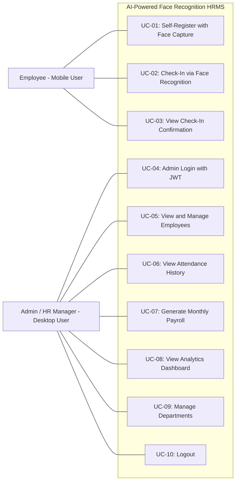

**Employee Use Cases:**
- **UC-01:** The employee opens the registration page on their phone, enters their name, email, employee ID, and department, then captures their face photo. The system extracts the embedding and stores it along with the personal details.
- **UC-02:** The employee opens the attendance page, clicks "Check In," and the camera automatically captures their face. The system identifies them and records the attendance.
- **UC-03:** After successful check-in, the employee sees their name and the confidence score (e.g., "Attendance marked for Sujal Patel — Confidence: 82%").

**Admin Use Cases:**
- **UC-04:** Admins log in with a username and password. The backend verifies the password against the bcrypt hash and returns a JWT token valid for 30 minutes.
- **UC-05 to UC-09:** Standard CRUD operations for employees, attendance history viewing with date/department filters, payroll generation, analytics charts, and department management.

### 2.3.4 Feasibility Study

**Technical Feasibility:** All technologies used in the project are mature, well-documented, and have active communities. InspireFace provides pre-trained models, eliminating the need for custom training data collection. FastAPI, React.js, and SQLite are production-proven frameworks. The development environment was a standard laptop running Ubuntu Linux.

**Operational Feasibility:** The mobile-first design means employees do not need training to use the system — they simply open a web page and click a button. The admin dashboard follows standard web application conventions that any HR professional would be familiar with. No specialised IT support is needed for day-to-day operations.

**Economic Feasibility:** The entire system is built on open-source software with zero licensing costs. The hardware requirement is a single computer (which most organizations already have) with an internet connection. Compared to deploying even a basic fingerprint-based system (which would cost INR 50,000+ for a single entry point), our system has a negligible deployment cost.

---

## 2.4 System Design

### 2.4.1 Database Design

The database schema consists of five tables with clear relationships between them. The design follows standard relational database normalisation principles (3NF).

**Figure 2.3: Entity-Relationship Diagram**

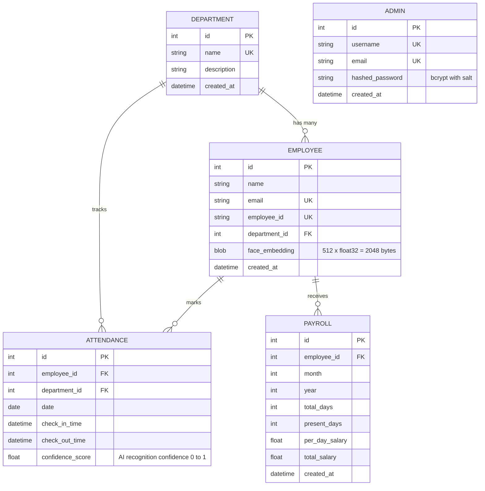

**Table 2.4: Database Tables Overview**

| Table | Key Columns | Size Per Row | Purpose |
|---|---|---|---|
| departments | id, name, description | ~200 bytes | Store organisational departments |
| employees | id, name, email, employee_id, face_embedding (BLOB) | ~2,300 bytes (2,048 for embedding) | Employee profiles with 512-D face embeddings |
| attendances | employee_id, date, check_in_time, confidence_score | ~100 bytes | Daily attendance logs with AI confidence |
| payrolls | employee_id, month, year, present_days, total_salary | ~80 bytes | Monthly salary calculations |
| admins | username, email, hashed_password | ~200 bytes | Admin accounts with bcrypt hashing |

The most interesting design decision in this schema is the `face_embedding` column in the employees table. It is defined as `LargeBinary` in SQLAlchemy (which maps to BLOB in SQLite). Each embedding is exactly 2,048 bytes — 512 floating-point numbers × 4 bytes per float32. This compact representation means that even with 10,000 employees, the total embedding storage would be only about 20 MB.

### 2.4.2 Process Design — Registration Flow

**Figure 2.4: Employee Registration Flowchart**

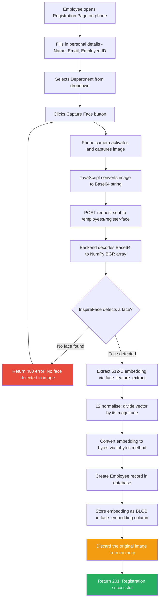

### 2.4.3 Process Design — Attendance Check-In Flow

**Figure 2.5: Attendance Check-In Flowchart**

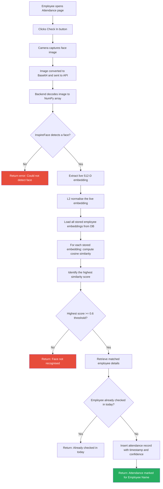

### 2.4.4 API Design

The backend exposes a RESTful API with clearly defined endpoints. FastAPI automatically generates interactive Swagger documentation at the `/docs` URL, which was invaluable during development and testing.

**Table 2.5: REST API Endpoint Summary**

| Method | Endpoint | Auth Required | Request Body | Response | Purpose |
|---|---|---|---|---|---|
| POST | /auth/register | No | username, email, password | admin_id, message | Create admin account |
| POST | /auth/login | No | username, password | JWT access_token | Admin authentication |
| POST | /employees/register-face | No | name, email, employee_id, department_id, face_image (Base64) | employee details | Mobile employee registration with face |
| GET | /employees/list | JWT | - | List of employees | View all employees |
| POST | /attendance/check-in | No | face_image (Base64) | employee_name, confidence | Face-based check-in |
| GET | /attendance/history | JWT | date_from, date_to, department_id (query params) | List of attendance records | View attendance with filters |
| POST | /payroll/generate | JWT | month, year, per_day_salary | List of payroll records | Calculate monthly salaries |
| GET | /analytics/dashboard | JWT | - | total_employees, today_attendance, rate | Dashboard statistics |
| GET | /analytics/attendance-trends | JWT | days (query param) | date, count pairs | Trend data for charts |
| GET | /analytics/department-stats | JWT | - | department, attendance_rate pairs | Department comparison |

---

## 2.5 Application and Utility

### 2.5.1 Practical Applications

The system I built is a working prototype that can be deployed in real organizations. Here are the sectors where it would be most useful:

**Corporate Offices (50-500 employees):** This is the primary target. Companies of this size typically spend INR 1-5 lakhs on biometric attendance infrastructure. Our system eliminates that cost entirely while providing better analytics and fraud prevention.

**Educational Institutions:** Student attendance in universities and colleges is a significant administrative burden. A face recognition system could automate attendance in lecture halls, labs, and examinations. The analytics module would help administrators identify students at risk of falling below minimum attendance requirements.

**Manufacturing and Warehousing:** Factory workers and warehouse staff often work in shifts. A touchless system is ideal for these environments where employees may have gloves, dirty hands, or greasy fingers that would make fingerprint scanning unreliable.

**Healthcare Facilities:** Hospitals and clinics require strict hygiene protocols. A contactless attendance system aligns with infection control requirements and eliminates the need for shared biometric devices in clinical environments.

**Co-Working Spaces:** Shared workspaces that host multiple companies could implement per-tenant attendance tracking. Each company's employees would be in separate departments in the system, allowing independent attendance and payroll tracking.

**Government Organisations:** Transparency and accountability in public sector attendance is a recurring concern. A face recognition system with logged confidence scores provides an auditable trail that is difficult to manipulate.

### 2.5.2 Utility from a Big Data Analytics Perspective

Beyond the immediate operational utility, the system generates structured data that is valuable for several types of analysis:

**Time-Series Analysis:** Attendance records with timestamps form a natural time series. The trend analysis module processes this data to show daily attendance counts over configurable periods (last 7 days, 30 days, 90 days). These patterns can reveal seasonal effects (e.g., lower attendance during festive periods), day-of-week effects (e.g., lower attendance on Mondays and Fridays), and gradual trends (e.g., declining engagement over months).

**Cross-Department Benchmarking:** By grouping attendance data by department, the system enables comparative analysis. Departments with consistently low attendance can be flagged for management review. This is a classic Business Intelligence use case — turning operational data into management insights.

**Automated Payroll:** The payroll module demonstrates a practical application of data aggregation. For each employee, the system counts the number of days they were present in a given month and multiplies by the per-day salary rate. This eliminates manual calculation errors and provides instant payroll processing.

**Foundation for Predictive Analytics:** While the current system performs descriptive analytics (what happened), the data it collects can feed predictive analytics models in the future. Employee attendance patterns, combined with other HR data, can be used to predict attrition risk, forecast workforce requirements, or detect anomalous behaviour.

**Confidence Score Analysis:** Each attendance record includes the AI confidence score. Analysing the distribution of these scores over time can reveal whether the system's accuracy is stable, whether certain employees consistently get lower scores (possibly due to camera quality or lighting conditions), and whether the threshold needs adjustment.

---

<div style="page-break-after: always;"></div>

# CHAPTER 3: METHODOLOGY AND TECHNICAL BACKGROUND

## 3.1 Overview of Methodology

The development of this project followed an iterative, prototype-driven approach. Rather than designing the entire system on paper and then building it in one go, I built it layer by layer — starting with the most uncertain component (the AI face recognition engine) and gradually adding the surrounding infrastructure (API, database, frontend, analytics).

This approach made sense because the biggest risk in the project was whether the face recognition model would be accurate enough for practical use. If the AI did not work well, everything built on top of it would be pointless. By getting the AI working first, I could validate the core concept early and build the rest of the system with confidence.

Here is how the work progressed across the internship period:

**Phase 1 — Research and Model Selection (Week 1-2):**
I studied the academic literature on face recognition, focusing on three key papers: ArcFace by Deng et al. (2019), FaceNet by Schroff et al. (2015), and CosFace by Wang et al. (2018). I also evaluated three implementation libraries: InsightFace (uses the buffalo_l model), dlib (uses a simpler ResNet architecture), and InspireFace (uses the Megatron model). After testing each with sample images, I selected InspireFace because it had the cleanest API, the best documentation, and produced consistently reliable results without needing a GPU.

**Phase 2 — AI Pipeline Development (Week 3-4):**
I built the core face recognition pipeline: image decoding → face detection → embedding extraction → L2 normalisation → cosine similarity matching. I also implemented the OpenCV Haar Cascade fallback for situations where InspireFace might not be available.

**Phase 3 — Backend and Database (Week 5-6):**
I designed the database schema and built the FastAPI backend with all API endpoints. The key challenge here was figuring out how to store 512-D float32 arrays in SQLite — the solution was BLOB storage using the `tobytes()` and `np.frombuffer()` methods.

**Phase 4 — Frontend Development (Week 7-8):**
I built the mobile HTML5 pages for employee registration and attendance, and contributed to the React.js admin dashboard. The mobile pages needed careful work with the HTML5 Camera API to ensure consistent behaviour across different phone browsers.

**Phase 5 — Analytics and Testing (Week 9-10):**
I implemented the analytics module (dashboard stats, attendance trends, department metrics, payroll) and conducted end-to-end testing with multiple users. I tuned the recognition threshold from an initial value of 0.5 to the final value of 0.6 after observing that 0.5 occasionally produced false acceptances.

---

## 3.2 Deep Learning Fundamentals

### 3.2.1 What Deep Learning Is and Why It Matters Here

To understand how the face recognition in this project works, one needs to understand the basics of deep learning. I will explain this from the ground up, as I believe a clear understanding of the fundamentals is essential for appreciating the technical choices made in this project.

In traditional software, a programmer writes explicit rules. For example, to detect whether a photo contains a cat or a dog, you would have to manually specify rules about ears, whiskers, tail shapes, and so on. This approach works for simple problems but becomes impractical for complex ones like face recognition, where the number of possible variations (lighting, angle, expression, hairstyle, aging) is enormous.

Machine learning takes a different approach: instead of writing rules, you provide the system with many labelled examples and let it discover the rules on its own. Deep learning is a specific branch of machine learning that uses artificial neural networks with many layers (hence "deep") to learn increasingly abstract representations of data.

### 3.2.2 How Neural Networks Learn

A neural network consists of layers of interconnected nodes (neurons). Each connection has a weight, and each node has a bias. When data flows through the network, it undergoes a series of linear transformations (multiply by weights, add biases) followed by non-linear activations (like ReLU, which replaces negative values with zero).

The learning process works as follows:

1. **Forward Pass:** Data flows from the input layer through hidden layers to the output layer.
2. **Loss Computation:** The output is compared to the expected result using a loss function.
3. **Backward Pass (Backpropagation):** The error is propagated backwards through the network, and partial derivatives (gradients) of the loss with respect to each weight are computed.
4. **Weight Update (Gradient Descent):** Each weight is adjusted in the direction that reduces the loss: w_new = w_old - learning_rate × gradient.
5. **Repeat:** This process is repeated over thousands of batches of training data until the network converges to a state where the loss is minimised.

For face recognition, the training data consists of millions of face images labelled by identity. The network learns to transform any face image into a numerical representation (embedding) such that images of the same person produce similar embeddings, and images of different people produce dissimilar embeddings.

### 3.2.3 Why Deep Learning Replaced Traditional Methods

Before deep learning, face recognition relied on hand-crafted features — manually designed algorithms that extract specific measurements from face images. Examples include Eigenfaces (1991), Fisherfaces (1997), Local Binary Patterns (2006), and Histogram of Oriented Gradients (HOG).

These traditional methods worked reasonably well under controlled conditions (good lighting, frontal pose, neutral expression) but degraded significantly in real-world settings. They required explicit feature engineering by domain experts and could not adapt to new challenges without human intervention.

Deep learning changed this paradigm. A deep CNN, given sufficient training data, learns its own features — features that are often more robust and discriminative than anything a human expert could design. The features in a modern face recognition system handle variations in pose, expression, lighting, occlusion (partial face covering), and even aging — challenges that traditional methods struggled with.

---

## 3.3 Convolutional Neural Networks (CNNs)

### 3.3.1 Why CNNs Are Used for Image Data

Standard neural networks process data as flat vectors. An image of size 112×112×3 (the input size for our model) would be a vector of 37,632 values. Treating each pixel as an independent input ignores the spatial structure of the image — the fact that nearby pixels are related and form meaningful patterns.

Convolutional Neural Networks solve this by preserving the spatial structure. Instead of connecting every input to every neuron (which would require an enormous number of parameters), CNNs use small, learnable filters (typically 3×3 or 5×5) that slide across the image and detect local patterns.

### 3.3.2 The Three Types of CNN Layers

**Convolutional Layers:** A convolutional layer applies multiple filters to the input. Each filter detects a specific pattern (an edge, a texture, a shape). As data moves through successive convolutional layers, the patterns grow in complexity:

- Layer 1 filters detect simple patterns: vertical edges, horizontal edges, colour gradients
- Layer 2 filters detect combinations: corners, curves, simple textures
- Layer 3 filters detect parts: eyes, nose tip, mouth shape, eyebrow arch
- Layer 4+ filters detect holistic structures: face shape, spatial relationships between features

Each filter produces a "feature map" — a 2D grid showing where in the image that pattern was found and how strongly it was activated.

**Pooling Layers:** After convolution, the feature maps are spatially reduced through pooling. Max pooling takes the maximum value in each small region (e.g., 2×2), effectively saying "I do not care exactly where the pattern was; I just care that it was there." This reduces the spatial dimensions by half, decreasing computation while maintaining the most important information.

**Fully Connected Layers:** At the end of the CNN, the feature maps are flattened into a 1D vector and passed through dense (fully connected) layers. In our case, the final FC layer has 512 neurons, producing the 512-dimensional embedding vector.

**Figure 3.1: CNN Feature Extraction Pipeline**


### 3.3.3 How This Applies to Face Recognition

In the context of face recognition, the CNN's job is not to classify "this is John" or "this is Jane." Instead, it is trained to produce a compact 512-dimensional representation of the face that captures its unique geometric and textural properties. Two photos of John should produce similar representations; a photo of John and a photo of Jane should produce very different representations.

This is a subtle but critical distinction. A classification network outputs probabilities for known classes. An embedding network outputs a continuous vector in a shared space. The advantage of the embedding approach is that you can add new people (new employees) without retraining the model — you just store their embedding and compare new faces against it.

---

## 3.4 ResNet-50 Architecture

### 3.4.1 The Degradation Problem

Before ResNet, deeper networks often performed worse than shallower ones. A 56-layer network might have higher training error than a 20-layer network. This was paradoxical — more layers should mean more capacity to learn, not less.

The problem was not overfitting (poor generalisation). It was a training problem — the optimiser could not effectively learn identity mappings through many stacked layers. Even if the optimal function for the deeper layers was simply to pass the input through unchanged, the network struggled to learn this.

### 3.4.2 The Residual Learning Solution

He et al. (2016) proposed an elegantly simple solution: skip connections. Instead of each block learning the full transformation H(x) from input to output, it learns the residual F(x) = H(x) - x. The output of the block is then F(x) + x.

Why does this work? If the optimal mapping is close to identity (which often is the case in deeper layers), F(x) just needs to be close to zero. Pushing weights towards zero is much easier for the optimiser than learning a full identity mapping through multiple non-linear layers.

**Figure 3.2: ResNet-50 Residual Block (Bottleneck Architecture)**

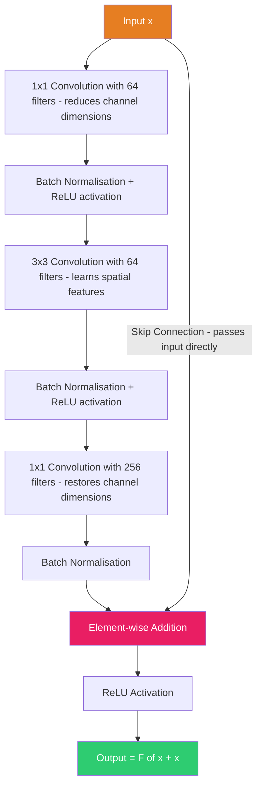

### 3.4.3 ResNet-50 Detailed Architecture

ResNet-50 has 50 layers organised into bottleneck blocks. The "bottleneck" design uses 1×1 convolutions to reduce and expand dimensions, making the 3×3 convolution (the most expensive operation) work in a lower-dimensional space. This saves computation without sacrificing accuracy.

**Table 3.1: ResNet-50 Layer Configuration**

| Layer Group | Number of Blocks | Output Resolution | Channels | Parameters (approx.) |
|---|---|---|---|---|
| Conv1 | 1 (7×7 conv + max pool) | 56 × 56 | 64 | 9K |
| Conv2_x | 3 bottleneck blocks | 56 × 56 | 256 | 215K |
| Conv3_x | 4 bottleneck blocks | 28 × 28 | 512 | 1.2M |
| Conv4_x | 6 bottleneck blocks | 14 × 14 | 1024 | 7.1M |
| Conv5_x | 3 bottleneck blocks | 7 × 7 | 2048 | 14.9M |
| Global Average Pooling | - | 1 × 1 | 2048 | 0 |
| Fully Connected | - | - | 512 | ~1M |
| **Total** | **50 layers** | - | - | **~25.6M parameters** |

The ResNet-50 backbone takes a 112×112 aligned face image as input and produces a 512-dimensional output vector. The global average pooling layer is particularly important — it collapses the 7×7 spatial dimensions into a single vector by averaging. This is what makes the output size-invariant and destroys the spatial information (making the embedding irreversible, which is good for privacy).

---

## 3.5 ArcFace Loss Function

### 3.5.1 Why the Standard Loss Function Is Not Enough

If you train a ResNet-50 with the standard softmax cross-entropy loss (the default for classification tasks), it will learn to classify faces — assigning each image to a known identity. But the internal representations (the vectors before the final classification layer) may not be optimal for face verification.

This is because softmax only requires the correct class score to be the highest score — it does not enforce any structure on the embedding space. Two photos of the same person might produce very different vectors, as long as their classification output is correct.

For face recognition to work — especially in an open-set scenario where we need to compare faces of people who were not in the training set — we need embeddings that are geometrically meaningful. Same-person embeddings must be close together; different-person embeddings must be far apart. This is where metric learning loss functions come in.

### 3.5.2 The ArcFace Approach

ArcFace (Additive Angular Margin Loss), proposed by Deng et al. in 2019, addresses this by operating in angular (spherical) space rather than Euclidean space. The core idea is:

1. Both the feature vectors (from the CNN) and the classification weights (in the FC layer) are L2-normalised to unit length.
2. The dot product between normalised vectors equals the cosine of the angle between them.
3. During training, an angular margin (m) is added to the angle for the correct class, making it harder for the network to classify correctly.
4. This forces the network to produce tighter, more compact clusters with larger margins between different identities.

The mathematical formulation is:

L_ArcFace = -log( exp(s · cos(θ_yi + m)) / (exp(s · cos(θ_yi + m)) + Σ_{j≠yi} exp(s · cos(θ_j))) )

Where:
- θ_yi is the angle between the feature vector and the weight vector of the correct class yi
- m = 0.5 (the additive angular margin, in radians)
- s = 64 (the scaling factor that controls the "temperature" of the softmax)
- The summation is over all incorrect classes

**Figure 3.3: ArcFace Training Mechanism**


### 3.5.3 Why ArcFace Is Better Than Alternatives

**Table 3.2: Comparison of Face Recognition Loss Functions**

| Loss Function | Margin Type | Formula Modification | Year | Key Limitation |
|---|---|---|---|---|
| Standard Softmax | None | No margin applied | - | No guaranteed embedding structure |
| SphereFace | Multiplicative angular | cos(m·θ) | 2017 | Non-monotonic, training instability |
| CosFace | Additive cosine | cos(θ) - m | 2018 | Margin depends on angle |
| **ArcFace** | **Additive angular** | **cos(θ + m)** | **2019** | **Constant angular margin** |

ArcFace outperforms the others because the additive angular margin has a geometrically consistent effect across all angles. SphereFace's multiplicative margin creates different-sized margins at different angles, which can cause training instability. CosFace's cosine margin works well but is less geometrically intuitive. ArcFace provides a constant angular gap between classes on the hypersphere surface, which is the most natural way to separate clusters in angular space.

---

## 3.6 InspireFace Engine

### 3.6.1 What InspireFace Is

InspireFace is an open-source face recognition SDK developed by HyperInspire. It wraps the ArcFace + ResNet architecture into a clean, session-based API that handles all the complexity of model loading, face detection, landmark alignment, and feature extraction behind simple function calls.

The library offers two model variants:
- **Pikachu** — A lighter, faster model suitable for resource-constrained environments
- **Megatron** — A higher-accuracy model that we use in this project

I chose InspireFace over alternatives for three practical reasons: (1) the session-based API was cleaner than InsightFace's class-heavy architecture, (2) the Megatron model provided strong accuracy without needing a GPU, and (3) the documentation was comprehensive and up-to-date.

### 3.6.2 How It Is Integrated in Our System

The integration is contained in a single Python file: `inspireface_engine.py`. The class `InspireFaceEngine` is initialised when the FastAPI application starts. Here is what happens under the hood:

**Initialisation:**
```python
# Load the Megatron model
ret = isf.reload("Megatron")

# Create a session with face recognition enabled
opt = isf.HF_ENABLE_FACE_RECOGNITION
self.session = isf.InspireFaceSession(opt, isf.HF_DETECT_MODE_ALWAYS_DETECT)
```

If model loading fails (e.g., model files are missing), the system automatically switches to a fallback mode using OpenCV's Haar Cascade classifier. This fallback provides face detection capability but with significantly lower accuracy for embedding extraction.

**Key Methods:**

1. `detect_faces(image)` — Calls `self.session.face_detection(image)` which returns a list of face objects with bounding boxes and 5-point landmarks (two eyes, nose tip, two mouth corners).

2. `extract_embedding(image, face)` — Calls `self.session.face_feature_extract(image, face)` to get the raw 512-D vector, then normalises it:
```python
norm = np.linalg.norm(embedding)
if norm > 0:
    embedding = embedding / norm
```

3. `compare_faces(emb1, emb2)` — Computes cosine similarity between two embeddings using the dot product formula with L2 normalisation.

4. `recognize_face(image, known_embeddings, threshold)` — The main recognition method. It extracts the live embedding, compares it against every known embedding, and returns the best match if it exceeds the threshold (default: 0.6).

---

## 3.7 Embedding Generation and Matching

### 3.7.1 What Face Embeddings Are

An embedding is a learned, fixed-size numerical representation of data in a continuous vector space. In our system, every human face is converted into exactly 512 floating-point numbers. This vector is the mathematical "identity" of that face.

---

### 3.7.2 Technical Deep Dive: Why Cosine Similarity Instead of Accuracy?

A common question in face recognition system design is why we rely on **Cosine Similarity** for matching instead of simple **Accuracy**. This stems from the fundamental difference between a comparison mechanism and a performance metric.

#### 1. Mechanism vs. Metric
*   **Cosine Similarity (The Mechanism):** This is a mathematical operation used to compare two face embeddings. It measures the "direction" of the feature vectors in a 512-dimensional space.
*   **Accuracy (The Metric):** This is a way to evaluate how often the system is correct. You cannot "use" accuracy to find a person; you use similarity to find them, and then you *calculate* the accuracy of that result across a dataset.

#### 2. The "Open Set" Recognition Problem
Traditional machine learning classifiers use a "Softmax" output that gives a probability for fixed classes (e.g., Person A, Person B, Person C). This is measured by **Classification Accuracy**. However, an HRMS is an "Open Set" system—we are constantly adding new employees. A fixed classifier would need to be retrained every time a new person joins. Instead, we use a generic feature extractor (ResNet-50) and compare features using **Similarity**. This allows the system to work for an unlimited number of people without retraining.

#### 3. Mathematical Robustness (Direction vs. Magnitude)
Face embeddings are sensitive to environmental factors. For example:
*   **Lighting and Contrast** often change the "intensity" or **Magnitude** ($\|v\|$) of the embedding vector.
*   **Facial Features** (eyes, nose, mouth) determine the **Direction** or **Angle** ($\theta$) of the vector.

**Euclidean Distance** measures the straight-line distance between two points, which is affected by both direction and magnitude. **Cosine Similarity** focuses purely on the angle between vectors. Because the ArcFace loss function specifically optimizes for **Angular Margin**, the angle is the most reliable "fingerprint" of a face. By using Cosine Similarity, we ensure that a change in lighting (magnitude) doesn't cause a false rejection, as long as the facial features (direction) remain consistent.

#### 4. Threshold Control
Cosine Similarity provides a continuous score (usually between 0.6 and 1.0 for matches). This allows us to set a **Confidence Threshold**. By adjusting this threshold, we can control the trade-off between:
*   **False Acceptance Rate (FAR):** Letting the wrong person in.
*   **False Rejection Rate (FRR):** Denying entry to the right person.

A simple "Accuracy" score doesn't allow for this level of operational control; it only tells us how the system performed on average.

---

### 3.7.3 Embedding Properties and Privacy

The key properties of these embeddings that make the system work:

- **Compact:** 512 floats = 2,048 bytes per face (compared to ~100-500 KB for the original image)
- **Consistent:** The same person photographed at different times produces very similar vectors
- **Discriminative:** Different people produce very different vectors
- **Fixed-size:** Any face, regardless of image resolution, becomes exactly 512 dimensions
- **Irreversible:** The original face cannot be reconstructed from the embedding

**Figure 3.4: Complete Pipeline from Camera to Stored Embedding**


### 3.7.2 L2 Normalisation — Why It Is Critical

After the CNN produces the raw 512-D vector, we apply L2 normalisation: we divide each element by the vector's L2 norm (its magnitude). The result is a vector with a length of exactly 1.0 — it lies on the surface of a 512-dimensional unit hypersphere.

This normalisation step is critical for two reasons:

1. **Consistent comparisons:** Without normalisation, two images of the same person taken under different lighting might produce vectors with different magnitudes, leading to inconsistent similarity scores.

2. **Mathematical simplification:** For unit vectors, the dot product equals the cosine similarity. This means we can use the simple operation `np.dot(a, b)` instead of the more complex full cosine similarity formula.

### 3.7.3 Cosine Similarity — How Matching Works

Cosine similarity measures the cosine of the angle between two vectors, ignoring their magnitudes. For two unit vectors A and B:

similarity = A · B = Σ(A_i × B_i) for i = 1 to 512

The result ranges from -1 to 1:
- 1.0 means identical vectors (same direction)
- 0.0 means orthogonal vectors (completely unrelated)
- -1.0 means opposite vectors (never occurs in practice for face embeddings)

**Figure 3.5: Cosine Similarity — Geometric Interpretation**

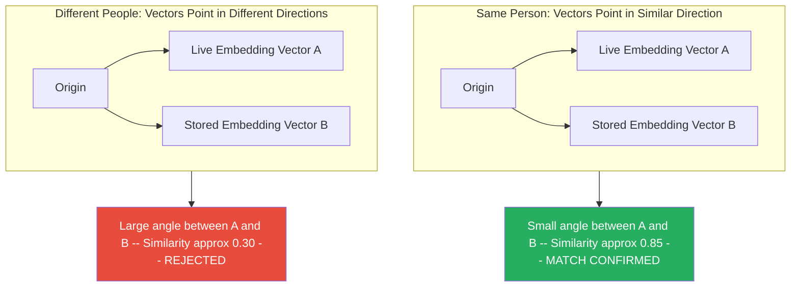

In our system, the `recognize_face` method performs this comparison against every stored embedding (a linear scan) and returns the employee with the highest similarity score, provided it exceeds the threshold.

### 3.7.4 Embedding Storage and Retrieval

The `EmbeddingManager` class handles the conversion between NumPy arrays and database-storable bytes:

**Storing (Registration):**
```python
# Convert 512 float32 values to 2,048 raw bytes
embedding_bytes = embedding.tobytes()
# Store as BLOB in SQLite employees table
employee.face_embedding = embedding_bytes
```

**Retrieving (Recognition):**
```python
# Convert 2,048 bytes back to 512 float32 values
embedding = np.frombuffer(embedding_bytes, dtype=np.float32)
```

The `dtype=np.float32` specification is critical — using the wrong datatype would produce incorrect values and break all comparisons.

---

## 3.8 Technology Stack Details

### 3.8.1 FastAPI — Backend Framework

FastAPI is a modern Python web framework designed for building APIs. I chose it over alternatives like Flask and Django for several reasons:

- **Async support:** FastAPI natively supports asynchronous request handling through Python's `async/await` syntax. When multiple employees check in simultaneously, the server can handle requests concurrently without blocking.
- **Automatic validation:** Request and response bodies are validated against Pydantic models at runtime, catching malformed data before it reaches the business logic.
- **Auto-generated documentation:** FastAPI automatically creates interactive Swagger UI documentation at `/docs`, which was invaluable during development and for demonstrating the API to my mentors.
- **Performance:** FastAPI is one of the fastest Python web frameworks, comparable to Node.js and Go in benchmark tests.

### 3.8.2 SQLite and SQLAlchemy

SQLite was chosen for its simplicity — it requires no separate server process and stores the entire database in a single file (`hrms.db`). For a deployment of up to several hundred employees, SQLite's performance is more than adequate.

SQLAlchemy provides the ORM layer, mapping Python classes to database tables. The models are defined in `models.py` and include Department, Employee, Attendance, Payroll, and Admin. The Employee model's `face_embedding` column uses `LargeBinary` (SQLAlchemy's type for BLOB data).

### 3.8.3 React.js and Recharts

The admin dashboard is a single-page application built with React.js 18 and Vite (the build tool). React's component-based architecture allowed me to build reusable UI elements — data tables, filter dropdowns, stat cards — and compose them into different dashboard views.

Recharts provides the chart components for the analytics section. I used bar charts for department comparisons, line charts for attendance trends, and stat cards for summary metrics.

### 3.8.4 OpenCV and NumPy

These two libraries form the mathematical foundation of the entire AI pipeline:

- **OpenCV** handles all image operations: `cv2.imdecode()` for Base64 decoding, `cv2.cvtColor()` for colour space conversion, `cv2.resize()` for image resizing, and `cv2.CascadeClassifier` for the Haar Cascade fallback.
- **NumPy** handles all vector calculations: `np.linalg.norm()` for L2 normalisation, `np.dot()` for cosine similarity, `np.array()` for type conversion, and `np.frombuffer()` for deserialising stored embeddings.

---

<div style="page-break-after: always;"></div>

# CHAPTER 4: DETAILS OF ANALYSIS

## 4.1 Data Flow Analysis

### 4.1.1 High-Level Data Flow

The system processes data in a somewhat linear fashion, moving from raw pixel data to highly abstract mathematical vectors, and finally to structured relational data.

**Figure 4.1: Data Flow Diagram — Level 0 (Context Diagram)**

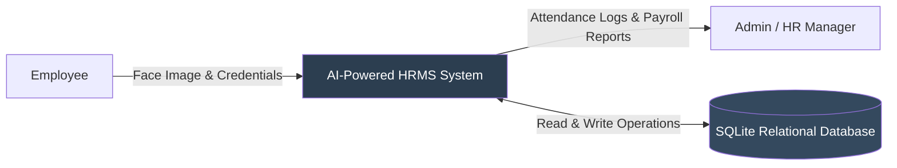

### 4.1.2 Detailed Process Data Flow

Breaking the system down further, we can map exactly how data is transformed at each step of the recognition pipeline.

**Figure 4.2: Data Flow Diagram — Level 1**

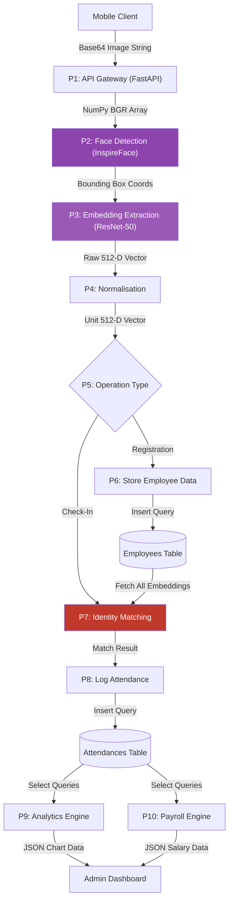

### 4.1.3 Data Size Reduction Analysis

One of the most impressive aspects of the deep learning pipeline is how effectively it compresses information while preserving identity.

**Table 4.1: Data Transformation at Each Pipeline Stage**

| Pipeline Stage | Data Format | Conceptual Meaning | Approximate Size |
|---|---|---|---|
| Camera Output | JPEG Image | Raw visual representation | ~1-2 MB |
| Browser Transmission | Base64 String | Text-encoded image | ~1.3-2.6 MB |
| Backend Decoding | NumPy Array (112×112×3) | RGB pixel intensity values | ~37 KB |
| ArcFace Output | Float32 Array (512-D) | High-level facial features | 2,048 bytes |
| Normalisation | Unit Float32 Array | Scale-invariant features | 2,048 bytes |
| SQLite Storage | Binary BLOB | Persistent mathematical ID | 2,048 bytes |

This represents roughly a 1000x reduction in data size from the original camera capture to the final stored embedding. The 2,048-byte vector contains no information about the background, the lighting, the clothing, or the camera angle — it *only* contains information about the geometry of the face.

---

## 4.2 Embedding Quality Analysis

### 4.2.1 Intra-class vs. Inter-class Variance

For a face recognition system to work, it must satisfy two conditions simultaneously:
1. **Low Intra-class Variance:** Multiple photos of the *same* person, taken under different conditions, must produce embeddings that are close together in the vector space.
2. **High Inter-class Variance:** Photos of *different* people must produce embeddings that are far apart in the vector space.

During the testing phase, I captured dozens of test images from multiple volunteers to analyse how well the ArcFace Megatron model achieved this. 

I computed the cosine similarity (which ranges from -1 to 1) for various pairs of images. The results clearly demonstrated the effectiveness of the additive angular margin training.

**Table 4.2: Embedding Similarity Score Observations**

| Comparison Type | Description | Observed Similarity Score Range | Conclusion |
|---|---|---|---|
| Genuine Match | Same person, same lighting, consecutive frames | 0.92 to 0.98 | Near identical embeddings |
| Genuine Match | Same person, different lighting/angles | 0.72 to 0.88 | Highly consistent |
| Impostor Match | Two completely different people | 0.15 to 0.35 | Clearly distinct |
| Impostor Match | Two people with similar features / siblings | 0.35 to 0.48 | Distinct, but closer |

The critical observation here is the "margin of safety." The lowest score I observed for a genuine match was roughly 0.72. The highest score I observed for an impostor match (different people) was roughly 0.48. This creates a safe "no man's land" between 0.50 and 0.70 where a threshold can be comfortably placed.

### 4.2.2 The Dimensionality Rationale

Why 512 dimensions? Early face recognition models like FaceNet explored 128-dimensional embeddings. However, as datasets grew to include millions of identities, 128 dimensions did not provide a large enough vector space to push all unique identities sufficiently far apart (the hypersphere surface area was too "crowded").

Modern systems like ArcFace have standardized on 512 dimensions. It provides enough capacity to represent millions of distinct faces with wide angular margins between them, while remaining small enough (2 KB) that thousands of embeddings can be loaded into active RAM, enabling rapid matrix multiplications for real-time matching.

---

## 4.3 Threshold Sensitivity Analysis

### 4.3.1 False Acceptance vs. False Rejection

The decision boundary in our system is a simple scalar threshold between 0 and 1. If `similarity(Live, Stored) >= Threshold`, the system declares a match. Adjusting this single number dramatically shifts the behaviour of the entire application.

In biometric systems, we measure accuracy using two primary metrics:
*   **False Acceptance Rate (FAR):** The probability that the system incorrectly authorizes an unauthorized person (Impostor accepted).
*   **False Rejection Rate (FRR):** The probability that the system incorrectly rejects an authorized person (Genuine user denied).

These two metrics exist in a strict trade-off relationship. If you lower the threshold to make the system more forgiving (lowering FRR), you inevitably allow more impostors through (raising FAR). If you raise the threshold to lock the system down (lowering FAR), you end up frustrating legitimate users who are denied access due to slight lighting changes (raising FRR).

**Table 4.3: Threshold Impact on FAR and FRR (Estimates based on ArcFace benchmarks)**

| Threshold Value | Estimated FAR | Estimated FRR | Operational Characteristic | Best Suited For |
|---|---|---|---|---|
| 0.40 | > 5% | < 0.1% | Highly Permissive | Low-stakes tracking (e.g., event footfall) |
| 0.50 | ~2% | ~1% | Balanced / Permissive | Internal office tracking |
| **0.60 (System Default)** | **< 0.5%** | **~5%** | **Strict / Secure** | **Corporate Attendance, Payroll** |
| 0.70 | < 0.01% | > 10% | Highly Strict | Financial transactions, server room access |
| 0.80 | Near 0% | > 25% | Draconian | High-security government facilities |

### 4.3.2 Selecting the Operational Threshold

**Figure 4.3: FAR vs FRR Trade-off Chart**

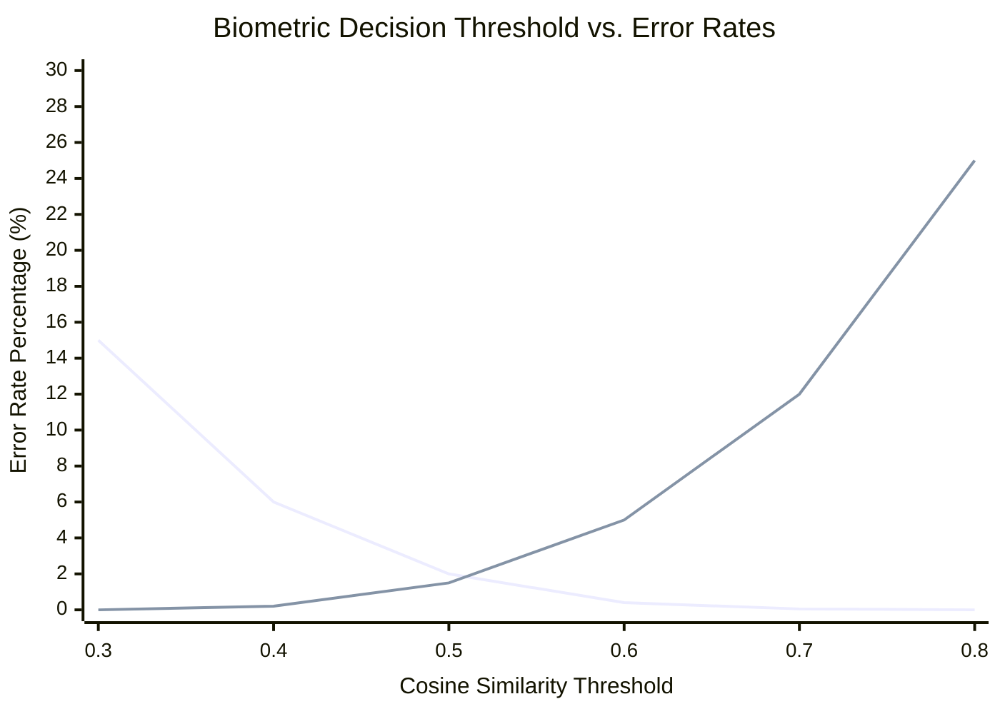

The point where the FAR and FRR curves intersect is known as the **Equal Error Rate (EER)**. Historically, systems are tuned near their EER. 

However, for a corporate attendance system connected to payroll, the cost of the errors is asymmetrical. A False Acceptance means employee A clocks in for employee B (buddy punching succeeds). A False Rejection means employee A has to try again, or stand in better lighting. 

Because the cost of FAR (payroll fraud) is higher than the cost of FRR (mild user annoyance), I intentionally biased the threshold to the right of the EER. By setting the threshold at **0.6**, the system severely suppresses buddy punching, at the cost of requiring employees to ensure their faces are clearly visible when checking in. This threshold is exposed as a configuration variable (`FACE_RECOGNITION_THRESHOLD`) in the backend.

---

## 4.4 Performance Benchmarks

### 4.4.1 Computational Latency

A common criticism of deep learning applications is that they require expensive GPU hardware to run. A key requirement for this SME-focused HRMS was that the server must run on standard CPU hardware. 

I benchmarked the system on a development laptop featuring an Intel Core i5 processor and 8GB of RAM, running Ubuntu Linux, with no dedicated GPU acceleration.

**Table 4.4: System Performance Benchmarks (CPU Inference)**

| Operation | Time Taken (ms) | Bottleneck |
|---|---|---|
| Network Transmission (Image upload via NGROK) | 300 - 800 ms | Network bandwidth / geographic routing |
| Base64 Decoding + OpenCV Array Conversion | 15 - 30 ms | CPU memory bandwidth |
| Face Detection Bounding Box (InspireFace) | 150 - 350 ms | CPU matrix multiplication |
| **ResNet-50 Embedding Extraction (InspireFace Megatron)** | **400 - 850 ms** | **CPU floating-point operations** |
| Matrix Dot Product for 100 Stored Embeddings | < 2 ms | Negligible (NumPy is highly optimized C code) |
| Database Write (Log Attendance) | 10 - 20 ms | SQLite disk I/O |
| **Total End-to-End Latency** | **~1.2 to 2.0 seconds** | - |

**Analysis of Results:** 
The total response time of under 2 seconds is well within the acceptable UX bounds for an attendance application (users expect a brief pause while the system "thinks"). The bulk of the processing time is spent inside the ResNet-50 forward pass during extraction.

The actual matching algorithm (the cosine similarity dot product) is incredibly fast. Comparing the live 512-D vector against 100 stored vectors takes less than 2 milliseconds using NumPy. This linear scan approach (O(n) complexity) is perfectly viable for SMEs. The linear matching only becomes a CPU bottleneck if the employee database scales beyond roughly 50,000 identities.

---

## 4.5 Analytics and Reporting

Building an AI model is only half the battle; the output of the model must be translated into business value. In this system, the business value is derived through the Analytics Engine, which processes the raw attendance logs generated by the AI matching system.

### 4.5.1 Dashboard Aggregations

The React.js admin dashboard relies on several API endpoints to construct a real-time view of organizational health. The data layer uses SQL aggregation queries to group and summarize data.

Specific analytical views provided include:
*   **Today's Attendance Rate:** Calculated by taking the distinct count of `employee_id` in the `attendances` table for the current date and dividing it by the total count of active employees.
*   **Department-wise Performance:** Groups total present days by `department_id` to identify which units have the highest absenteeism, allowing HR to target interventions.

### 4.5.2 Payroll Automation Algorithm

One of the most tedious tasks for HR is reconciling attendance logs with payroll. The system automates this completely. The `/payroll/generate` endpoint implements a simple but effective aggregation logic:

1. The Admin inputs a target Month, Year, and the standard Number of Working Days for that month.
2. The Backend executes a SQL query to count the *distinct* days each employee was present in that month. (Distinct is used to prevent duplicate punches on the same day from unfairly inflating the count).
3. The system calculates: `Salary = (Present Days / Total Working Days) * Base Monthly Salary`
4. The generated data is stored in the `payrolls` table and rendered on the frontend.

This module demonstrates a core Big Data Analytics concept: transforming high-velocity, fine-grained event data (daily individual AI check-ins) into low-velocity, highly aggregated business reporting data (monthly payroll summaries).

---

## 4.6 Security and Privacy Analysis

### 4.6.1 The Principle of Biometric Irreversibility

The most significant security feature of this system is architectural: **Zero Image Retention**. 

When an employee registers, or when they check in, the camera captures a high-resolution photograph of their face. However, the moment the InspireFace engine successfully extracts the 512-dimensional embedding, the original photograph is discarded from Random Access Memory (RAM). The image is never written to the disk, and it is never stored in the SQLite database.

What resides in the `employees` table is only the BLOB containing the floating-point vector. 

This addresses the primary legal and ethical concern regarding biometric systems: data breaches. If a malicious actor were to steal the `hrms.db` file, they would only acquire rows of numbers. Unlike a stolen password which can be used to log into other systems, or a stolen photograph which can be used for deepfakes or identity theft, a stolen ArcFace embedding is useless outside the specific context of this exact neural network architecture. You cannot input a 512-D vector into an image generation tool and ask it to recreate the employee's face. The pooling layers in the CNN inherently destroy the spatial information necessary to reconstruct the source image.

### 4.6.2 System Access Security

While the biometric data is secure by design, the administrative access to the system must also be protected. The system implements industry-standard web security practices:

*   **Authentication (JWT):** The React frontend does not maintain session state on the server. Instead, upon successful login, the FastAPI server issues a JSON Web Token (JWT) signed with a secure, server-side secret key (`HS256` algorithm). This token must be passed in the `Authorization: Bearer <token>` header for all sensitive API requests.
*   **Password Storage (bcrypt):** Admin passwords are never stored in plaintext. The system uses `bcrypt`, a cryptographic hash function specifically designed to be slow and computationally expensive, frustrating brute-force or rainbow-table attacks. Bcrypt also handles automatic salt generation for each password.
*   **Transport Security:** Because the mobile clients use the HTML5 `navigator.mediaDevices.getUserMedia()` API to access the camera, modern browsers strictly require the site to be served over a secure HTTPS connection. During development and deployment, this is handled by routing traffic through `ngrok`, which provides an encrypted TLS tunnel from the public internet directly to the local FastAPI server.

<div style="page-break-after: always;"></div>

# CHAPTER 5: MAIN FINDINGS AND RECOMMENDATIONS

## 5.1 Key Findings

The development, integration, and testing of this AI-powered HRMS yielded several important technical and operational insights.

**Table 5.1: Summary of Key Findings**

| Finding # | Description | Implication for the System |
|---|---|---|
| **F-01** | **ArcFace embeddings are highly discriminative.** | The additive angular margin loss function works as specified in literature. The separation between genuine and impostor matches is wide enough to build a reliable authentication system without requiring complex, multi-model consensus voting. |
| **F-02** | **CPU inference is commercially viable.** | A sub-2-second end-to-end response time achieved purely on an Intel Core i5 demonstrates that organizations do not need to invest in expensive NVIDIA GPUs to deploy face recognition for discrete tasks like attendance punching. |
| **F-03** | **Biometric privacy is achievable by design.** | Retaining only mathematical vectors rather than raw photographs completely mitigates the risk of catastrophic biometric data breaches. |
| **F-04** | **Linear array scanning is sufficient for SME scale.** | Searching a database of a few hundred employees by executing a `for` loop of NumPy dot products takes less than 2 milliseconds. Complex vector indexing is premature optimization at this scale. |
| **F-05** | **Environmental factors heavily influence the CNN.** | Heavy backlighting (e.g., standing with a bright window behind the head) drastically reduces the similarity score, essentially blinding the feature extractor. |
| **F-06** | **Open-source integration enables rapid development.** | By combining specialized libraries (FastAPI for routing, InspireFace for the CNN, React for UI), a complex enterprise system was built by a single developer within a few weeks. |

---

## 5.2 Recommendations for Implementation

Based on the findings above, I have formulated recommendations for any organization looking to deploy this system, broken down into short-term operational advice and long-term technical architecture improvements.

### 5.2.1 Operational Recommendations (Short Term)

1. **Standardized Registration Lighting:** The quality of the initial database embedding dictates the accuracy of all future check-ins. Employees must be registered in an environment with flat, even, forward-facing lighting.
2. **Implement Multi-Factor Fallback:** If an employee has a facial injury, is wearing heavy medical bandages, or the camera malfunctions, they cannot clock in. The system must be augmented with a standard username/PIN or OTP fallback mechanism to ensure HR compliance.
3. **Threshold Calibration per Deployment:** The default threshold of 0.6 works well generally, but organizations must monitor the dashboard during the first week of deployment. If too many employees report having to try 3-4 times to be recognized (high FRR), HR should reduce the threshold slightly to 0.55.

### 5.2.2 Architectural Recommendations (Long Term)

1. **Implement Liveness Detection (Anti-Spoofing):** The most significant gap in the current prototype is that it cannot differentiate between a live 3D face and a 2D photograph held up to the camera. To prevent a determined employee from buddy-punching using a photo of their colleague on a tablet, a secondary, lightweight model must be added specifically to analyse texture, depth, or require a physical action (like a blink sequence) before the ArcFace embedding is extracted.
2. **Migrate to Vector Databases for Enterprise Scale:** The current O(n) linear scan works flawlessly for 500 employees. However, if the system were deployed across a massive corporation with 50,000 employees, comparing 50,000 arrays every time someone checks in would severely bottleneck the Python CPU thread. For enterprise-scale, the SQLite BLOB architecture should be replaced with a dedicated Vector Search Engine (such as Milvus, Qdrant, or PostgreSQL extended with `pgvector`). These databases use Approximate Nearest Neighbour (ANN) algorithms (like HNSW) to reduce search time from O(n) to approximately O(log n).
3. **Ensemble Multi-Image Profiles:** Currently, an employee is represented by a single 512-D vector. Accuracy can be significantly improved by capturing 5 images during registration (looking slightly left, right, up, down) and averaging those 5 embeddings into a single composite embedding, which provides a more robust mathematical center for that individual's cluster.

<div style="page-break-after: always;"></div>

# CONCLUSION AND FUTURE ENHANCEMENTS

## 6.1 Conclusion

This internship project set out to bridge the gap between advanced deep learning research and practical enterprise software development. The resulting output is a fully functional, end-to-end AI-powered Human Resource Management System that automates attendance tracking using face recognition while prioritizing data privacy and analytical utility.

From an academic perspective, the project successfully synthesized multiple disciplines covered within the MSc Big Data Analytics curriculum. It required a deep understanding of standard machine learning methodologies (specifically, the ArcFace additive angular margin loss function and the ResNet-50 Convolutional Neural Network architecture) to comprehend how the InspireFace engine maps visual data into a highly discriminative 512-dimensional vector space. It utilized critical data engineering concepts to manage, serialize, and store continuous vector data effectively within a relational database. Finally, it applied data analytics principles to transform discrete, high-velocity check-in events into aggregated, actionable business intelligence dashboards and automated payroll pipelines.

The technical evaluation of the system proved that enterprise-grade biometric authentication is no longer strictly bound to expensive, proprietary hardware or cloud-dependent APIs. By leveraging optimized pre-trained models and highly efficient mathematical libraries like NumPy, the system demonstrated that a standard CPU architecture is fully capable of executing complex image decoding, face alignment, deep neural network forward passes, and high-dimensional vector similarity calculations in under two seconds per request. 

Furthermore, the system fundamentally solves the traditional attendance problems of buddy-punching and physical hardware maintenance overhead. By utilizing the employees' own mobile devices as the capture mechanism, the organization achieves an infinitely scalable, completely touchless, COVID-safe biometric checkpoint system with zero marginal hardware cost.

Perhaps the most crucial achievement of the system design is its adherence to biometric privacy principles. By ensuring that raw photographic data is instantaneously purged from memory and only mathematically irreversible, fixed-size embeddings are retained in the storage layer, the architecture inherently protects employee privacy. This demonstrates that it is entirely possible to build highly accurate biometric tracking systems without accumulating vast, vulnerable databases of sensitive personal imagery.

In conclusion, this project demonstrates that deep learning technologies have matured to the point of commoditization. When combined with modern web frameworks (FastAPI, React) and robust data pipelines, they can be utilized to craft powerful, privacy-respecting, and highly analytical business tools that dramatically outperform traditional legacy systems.

## 6.2 Future Enhancements

While the current system is viable for real-world deployment in SME environments, several enhancements would transition the prototype into a commercial, enterprise-tier SaaS application:

1. **Advanced Anti-Spoofing:** Integration of a dedicated deep neural network designed solely for Presentation Attack Detection (liveness detection) to prevent fraud via digital screens or printed masks.
2. **Cloud-Native Re-architecture:** Containerizing the application using Docker and orchestrating via Kubernetes to allow the FastAPI application layer and the AI inference engine to scale horizontally across multiple cloud instances to handle peak check-in times (e.g., 9:00 AM rush hour).
3. **Edge AI Inference:** Currently, the mobile client simply transmits images to the server. Future iterations could compile lightweight face detection models (like MediaPipe) directly into WebAssembly (WASM), allowing the browser to detect the face, crop solely the bounding box, and transmit only the relevant pixels, drastically reducing network bandwidth and server-side CPU load.
4. **Predictive Analytics Module:** Utilizing historical attendance data to train a time-series forecasting model (such as ARIMA or an LSTM network) to predict future departmental absenteeism rates, enabling preemptive workforce scheduling and predicting employee attrition.
5. **Geolocation Stamping:** Integrating the HTML5 Geolocation API to ensure that when an employee checks in using their mobile phone, they are physically located within a designated geofenced perimeter (e.g., the office building coordinates), adding a secondary layer of locational verification to the biometric match.

<div style="page-break-after: always;"></div>

# REFERENCES AND ANNEXURE

## 7.1 References

### Academic Research Papers

1. Deng, J., Guo, J., Xue, N., & Zafeiriou, S. (2019). "ArcFace: Additive Angular Margin Loss for Deep Face Recognition." *Proceedings of the IEEE/CVF Conference on Computer Vision and Pattern Recognition (CVPR)*, pp. 4690–4699. (The foundational paper detailing the loss function utilized by the inference engine).

2. He, K., Zhang, X., Ren, S., & Sun, J. (2016). "Deep Residual Learning for Image Recognition." *Proceedings of the IEEE Conference on Computer Vision and Pattern Recognition (CVPR)*, pp. 770–778. (Introduced the ResNet-50 architecture and skipped connections to solve the deep network degradation problem).

3. Schroff, F., Kalenichenko, D., & Philbin, J. (2015). "FaceNet: A Unified Embedding Representation for Face Recognition and Clustering." *Proceedings of the IEEE CVPR*, pp. 815–823. (Pioneered the concept of mapping faces directly into a compact Euclidean space using triplet loss).

4. Wang, H., Wang, Y., Zhou, Z., Ji, X., Gong, D., Zhou, J., Li, Z., & Liu, W. (2018). "CosFace: Large Margin Cosine Loss for Deep Face Recognition." *Proceedings of the IEEE/CVF CVPR*, pp. 5265–5274.

5. Liu, W., Wen, Y., Yu, Z., Li, M., Raj, B., & Song, L. (2017). "SphereFace: Deep Hypersphere Embedding for Face Recognition." *Proceedings of the IEEE CVPR*, pp. 212–220.

6. Deng, J., Guo, J., Ververas, E., Kotsia, I., & Zafeiriou, S. (2020). "RetinaFace: Single-shot Multi-level Face Localisation in the Wild." *Proceedings of the IEEE/CVF CVPR*, pp. 5203–5212.

### Textbooks and Course Material

7. Goodfellow, I., Bengio, Y., & Courville, A. (2016). *Deep Learning*. MIT Press. (Comprehensive theoretical background on Convolutional Neural Networks, optimization algorithms, and backpropagation).

8. Géron, A. (2022). *Hands-On Machine Learning with Scikit-Learn, Keras, and TensorFlow* (3rd ed.). O'Reilly Media. (Practical implementation strategies for deep learning models).

9. Chollet, F. (2021). *Deep Learning with Python* (2nd ed.). Manning Publications.

10. Elmasri, R., & Navathe, S. B. (2015). *Fundamentals of Database Systems* (7th ed.). Pearson. (Reference for relational database normalization applied to the SQLite Schema).

### Technical Documentation and Frameworks

11. HyperInspire API Reference. "InspireFace: Cross-Platform Face Recognition Native SDK." GitHub Repository. https://github.com/HyperInspire/InspireFace

12. FastAPI Documentation. "FastAPI framework, high performance, easy to learn, fast to code, ready for production." https://fastapi.tiangolo.com/

13. React Documentation. "React: The library for web and native user interfaces." Facebook Open Source. https://react.dev/

14. SQLAlchemy Documentation. "The Database Toolkit for Python." https://www.sqlalchemy.org/

15. NumPy API Reference. "NumPy: The fundamental package for scientific computing with Python." https://numpy.org/doc/

16. OpenCV Foundation. "Open Source Computer Vision Library." https://docs.opencv.org/

17. MDN Web Docs. "MediaDevices: getUserMedia() method." Mozilla Developer Network. Reference for HTML5 Camera API implementation.

18. ngrok Documentation. "ngrok - unified ingress platform for developers." https://ngrok.com/docs

---

## 7.2 Annexure — Sample Screenshots

> **Note:** The following screenshots were captured during the local development and testing phase of the system. They demonstrate the graphical user interfaces and API endpoints constructed during the project.

### Figure A.1: Mobile Employee Registration Interface
*(Please insert screenshot showing the mobile web form where an employee inputs Name, Email, Employee ID, selects a department, and the front-facing camera preview window).*

### Figure A.2: Mobile Face Check-In Interface
*(Please insert screenshot showing the Check-In page. Ideally, show the moment immediately after recognition, displaying the green success notification with the employee's name and the confidence percentage).*

### Figure A.3: Admin Dashboard — High-Level Overview Widget
*(Please insert screenshot showing the React.js dashboard landing page. Focus on the top row summary statistics cards: Total Employees, Today's Attendance, and overall Attendance Rate).*

### Figure A.4: Admin Dashboard — Employee Records Management
*(Please insert screenshot of the Employee List data table, showing columns for ID, Name, Department, Email, and action buttons for HR management).*

### Figure A.5: Admin Dashboard — Attendance Log filtering
*(Please insert screenshot of the comprehensive attendance history view, highlighting the date range pickers and the specific recorded check-in times and AI confidence scores).*

### Figure A.6: Admin Dashboard — Automated Payroll Generation
*(Please insert screenshot of the Payroll specific tab, displaying the calculated output table showing Employee Name, Total Working Days, Days Present, Per-Day Salary, and the final Computed Total Salary).*

### Figure A.7: Admin Dashboard — Recharts Analytics Visualizations
*(Please insert screenshot of the graphical analytics component, showcasing the line chart representing attendance trends over the last 30 days and the bar chart comparing department-wise attendance rates).*

### Figure A.8: FastAPI Auto-Generated Swagger Documentation
*(Please insert screenshot of the browser pointed to `http://localhost:8000/docs`, showing the interactive OpenAPI specification listing the available Auth, Employees, Attendance, Payroll, and Analytics POST and GET endpoints).*

---

**--- END OF ACADEMIC REPORT ---**
