# Mermaid Diagrams for Academic Report

All diagrams for the AI-Powered Face Recognition HRMS Academic Report.

---

## Figure 1.1: Overall System Architecture Diagram

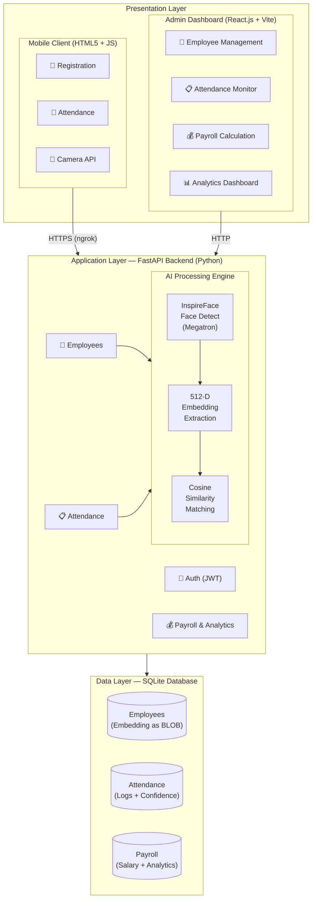

---

## Figure 2.1: System Workflow — End-to-End Pipeline

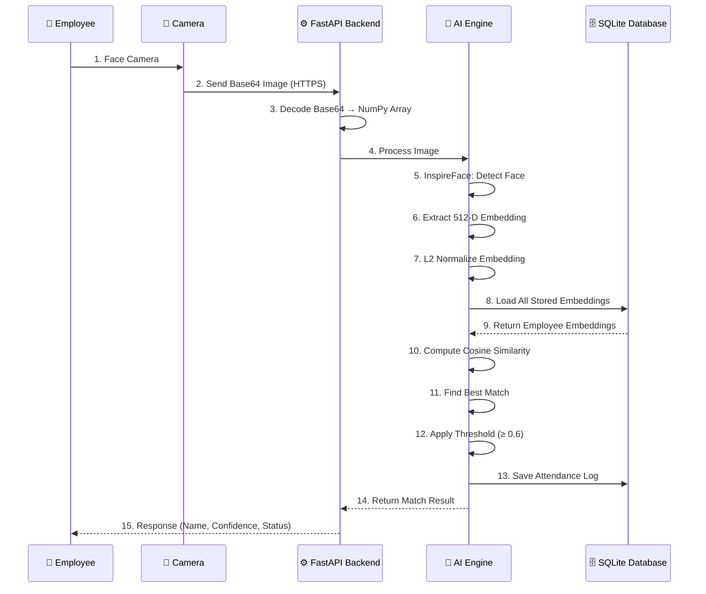

---

## Figure 2.2: Use Case Diagram — HRMS

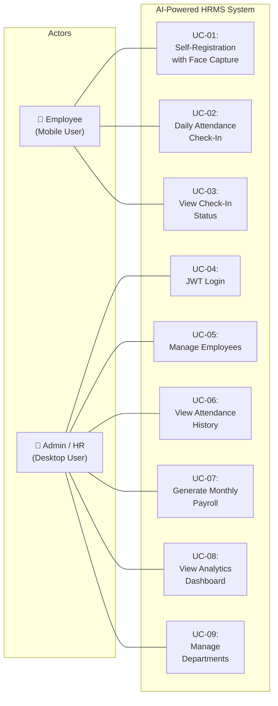

---

## Figure 2.3: Entity-Relationship (ER) Diagram

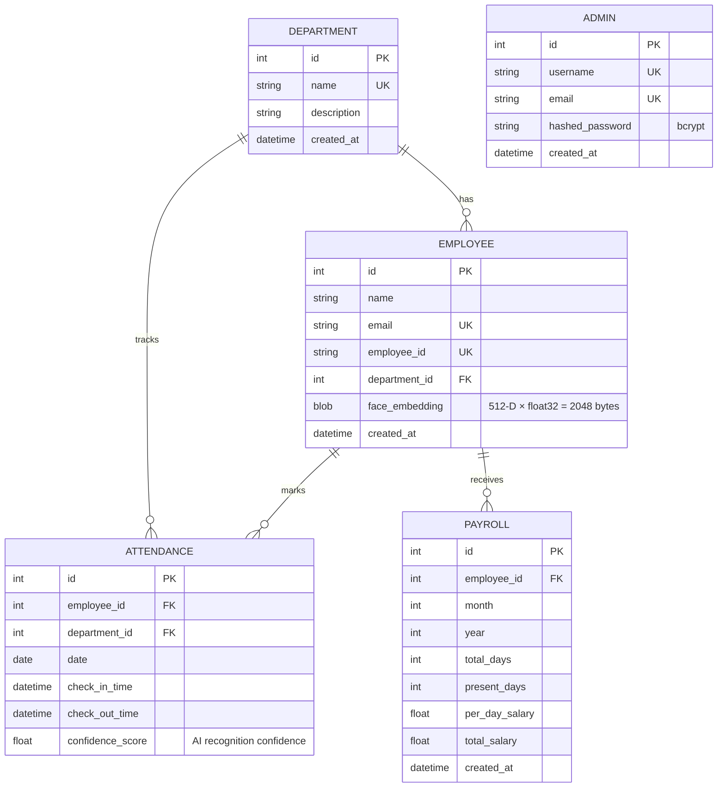

---

## Figure 2.5: Component Architecture Diagram

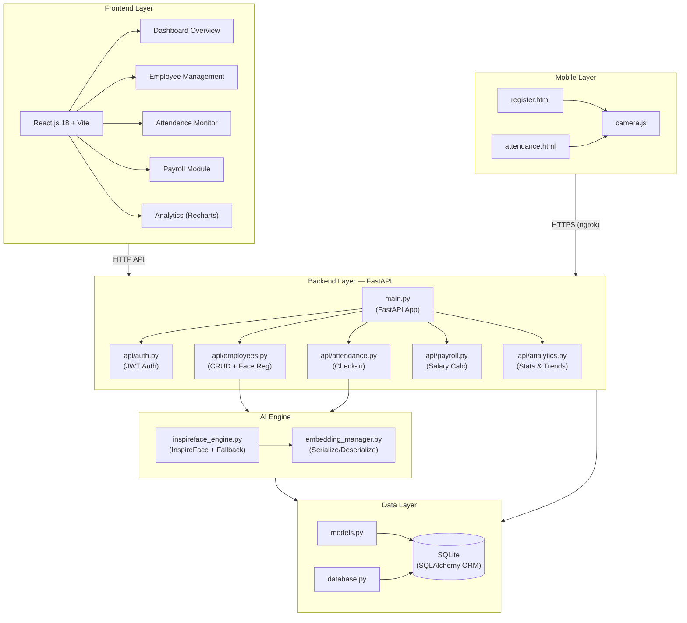

---

## Figure 3.1: Convolutional Neural Network — Layer Structure

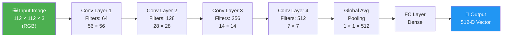

---

## Figure 3.2: ResNet-50 — Residual Block (Bottleneck)

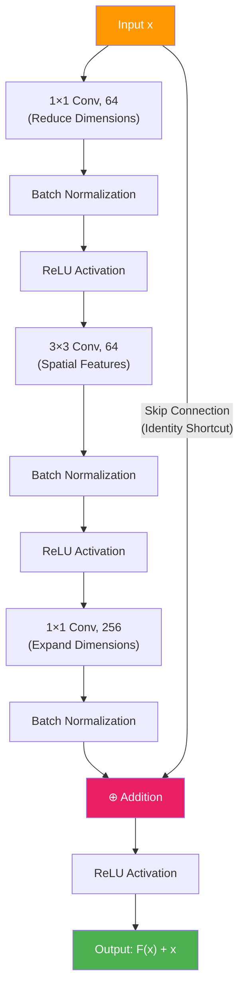

---

## Figure 3.3: ArcFace — Angular Margin on Hypersphere

```mermaid
graph TD
    subgraph Training["ArcFace Training Mechanism"]
        A["Aligned Face Image\n112 × 112 × 3"] --> B["ResNet-50\nBackbone"]
        B --> C["Raw Feature Vector x_i"]
        C --> D["L2 Normalize\nFeature x_i"]
        
        W["FC Layer Weights W_j"] --> E["L2 Normalize\nWeights W_j"]
        
        D --> F["Dot Product\nW_j^T × x_i = cos θ"]
        E --> F
        
        F -->|"Target Class y_i"| G["Add Angular Margin m\ncos(θ + m)"]
        F -->|"Other Classes j ≠ y_i"| H["No Margin\ncos θ_j"]
        
        G --> I["Multiply by Scale s"]
        H --> J["Multiply by Scale s"]
        
        I --> K["Softmax Loss"]
        J --> K
    end

    subgraph Inference["Inference Phase"]
        C2["Raw Feature Vector"] --> N["L2 Normalize"]
        N --> O["512-D Face Embedding\n(Unit Vector on Hypersphere)"]
    end

    style A fill:#4CAF50,color:#fff
    style G fill:#E91E63,color:#fff
    style O fill:#2196F3,color:#fff
```

---

## Figure 3.4: ArcFace + ResNet-50 — Complete Architecture

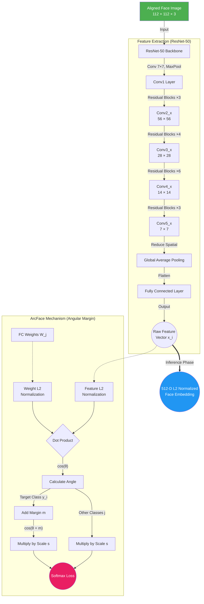

---

## Figure 3.5: Face Detection → Alignment → Embedding Pipeline

---

## Figure 3.6: Cosine Similarity — Geometric Interpretation

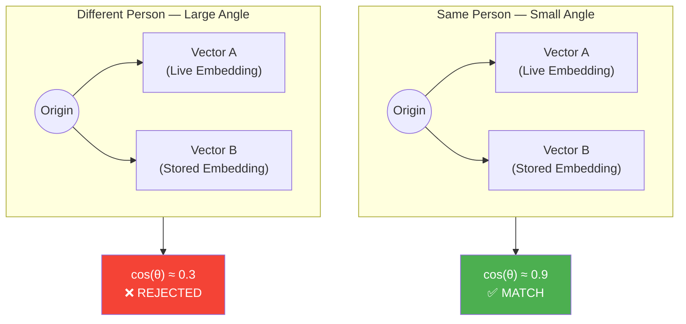

---

## Figure 4.1: Data Flow Diagram — Level 0 (Context)

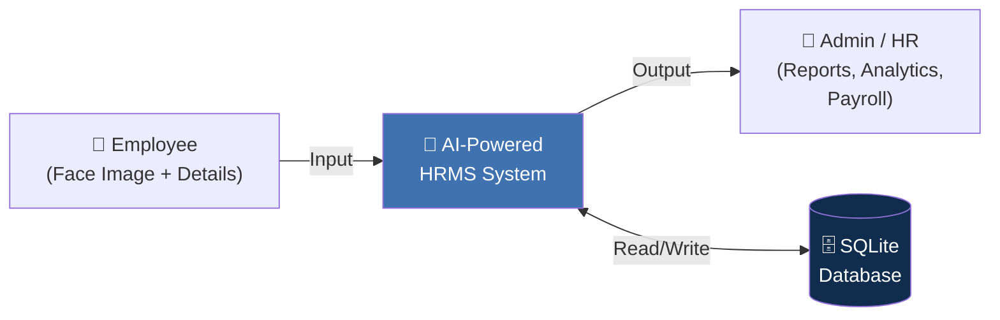

---

## Figure 4.2: Data Flow Diagram — Level 1

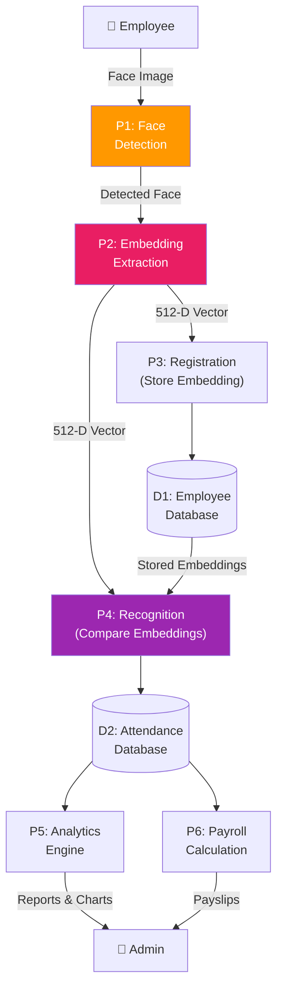

---

## Figure 4.3: Threshold vs. FAR/FRR Trade-off Curve

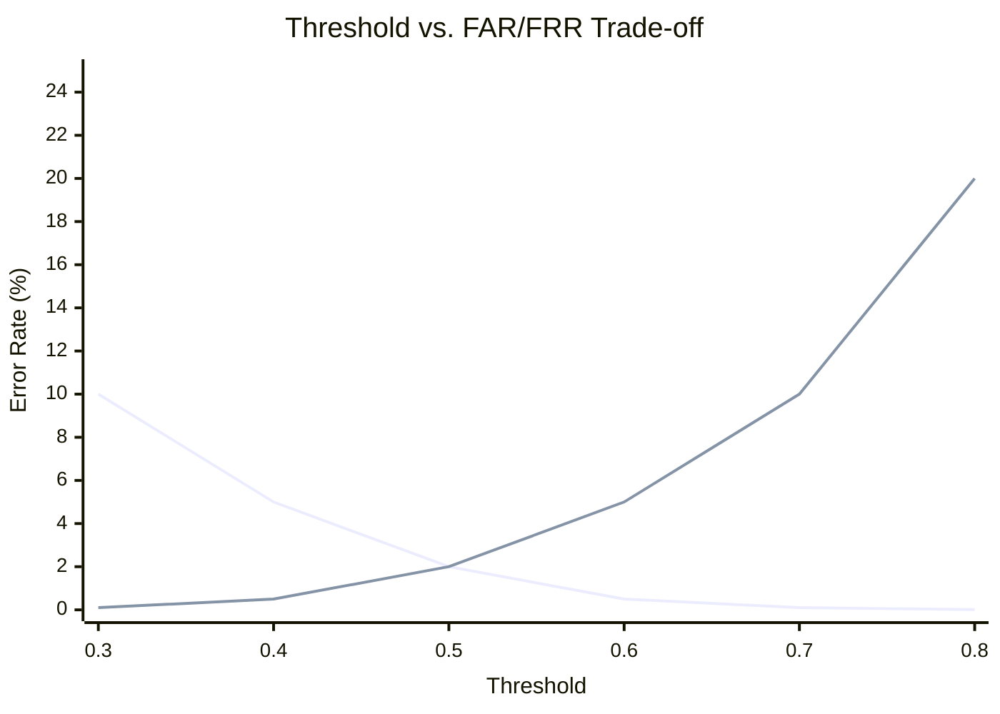

---

## Figure 4.4: Attendance Trend Analytics Dashboard

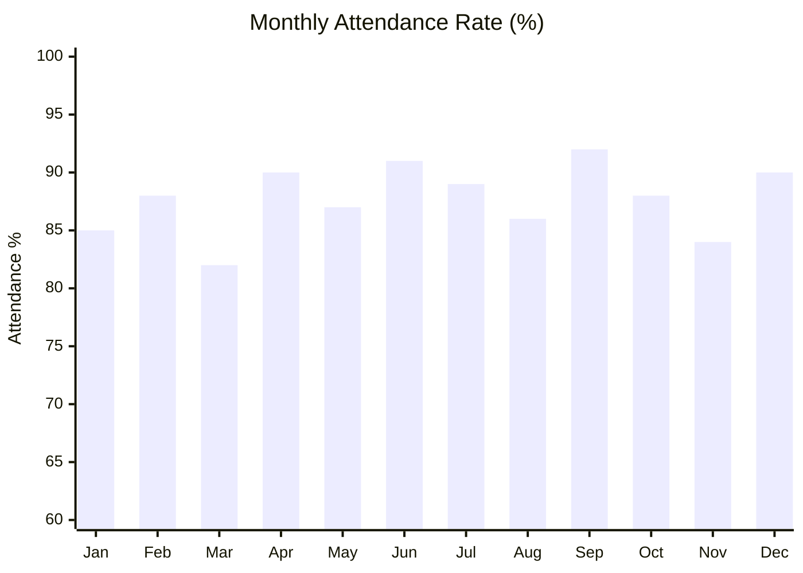

---

## Employee Registration Flow

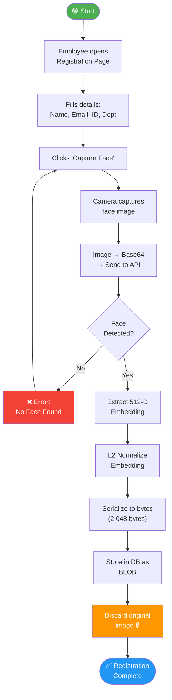

---

## Attendance Check-In Flow

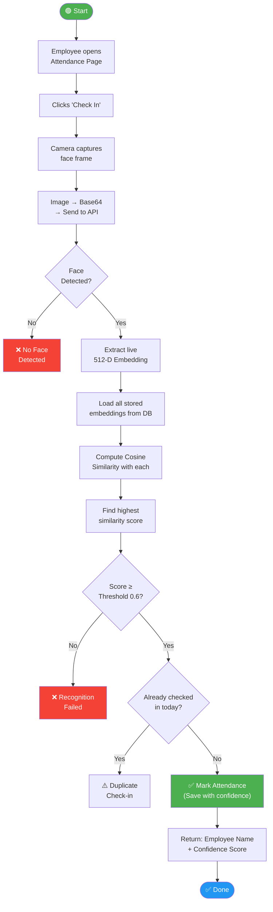

---

## AI Processing Pipeline (Detailed)

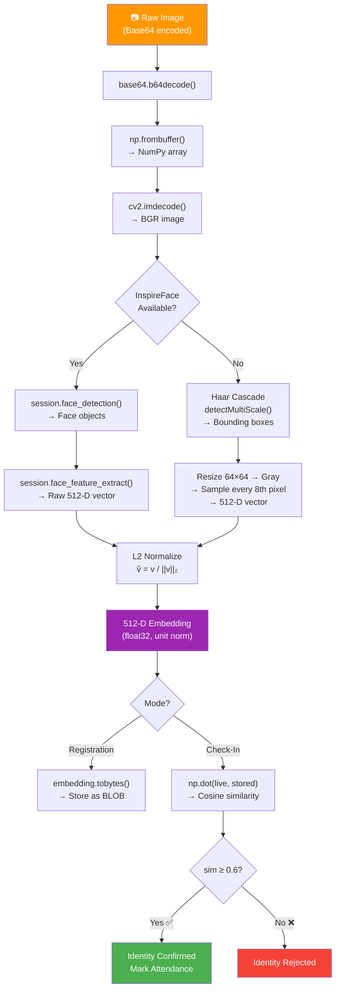

---

## System Deployment Architecture

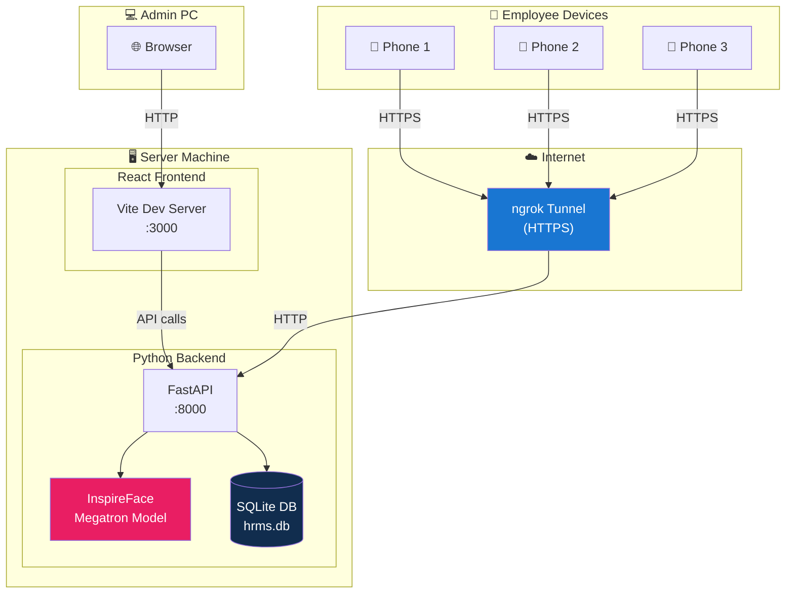
