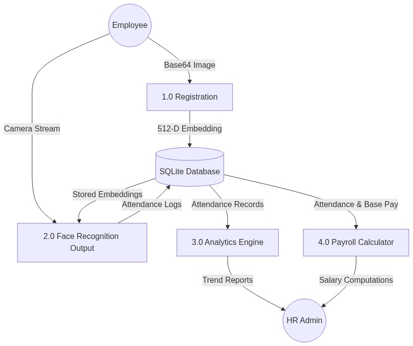
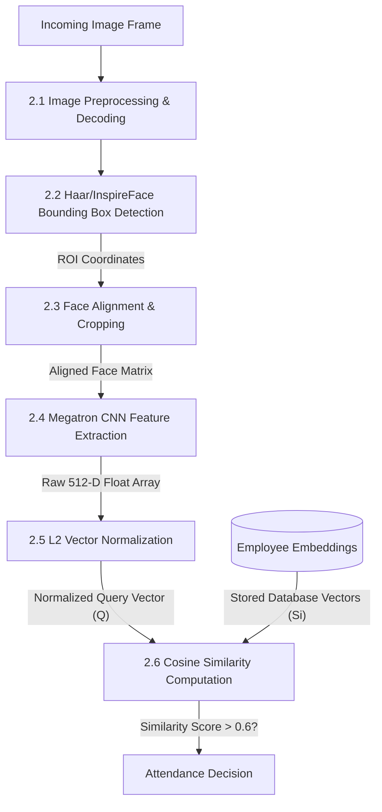
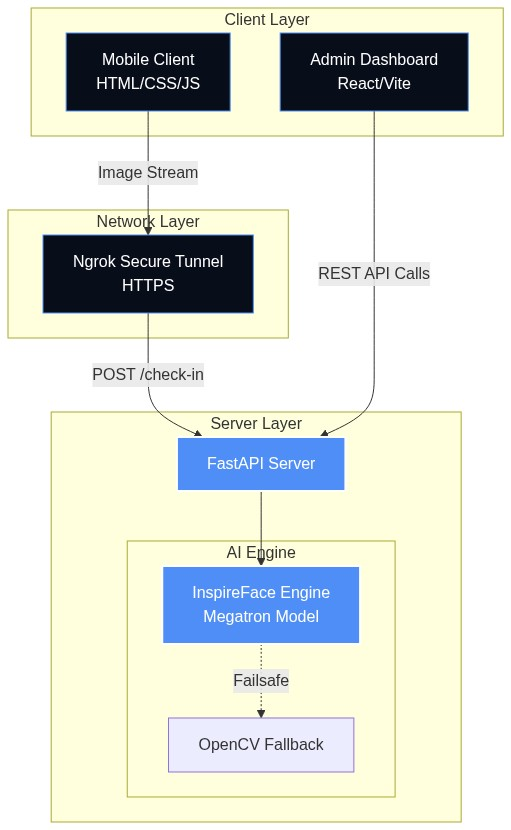
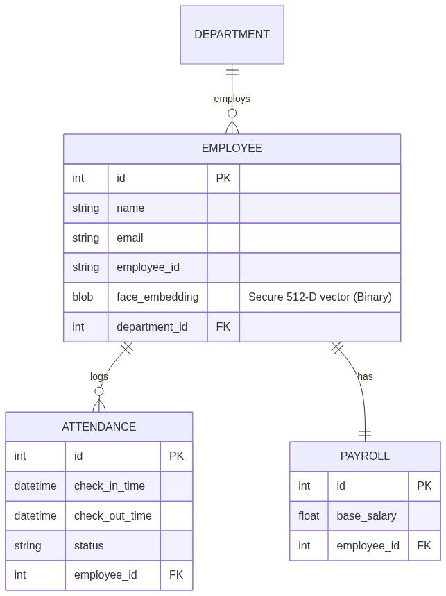

# FaceAI: An Advanced Biometric Human Resource Management System utilizing Edge-Based Deep Learning

## Abstract
Traditional attendance tracking systems, such as RFIDs or manual logbooks, are prone to proxy attendance, physical wear, and scheduling inefficiencies. **FaceAI** is a robust, contactless, and secure Human Resources Management System (HRMS) built around state-of-the-art deep learning facial recognition. This paper details the system study, analysis, architectural design, data flow models, and the underlying Artificial Intelligence methodology powering the FaceAI engine. The system achieves high accuracy using 512-dimensional embeddings and cosine similarity, all executed on commodity hardware without the need for discrete GPUs.

---

## 1. Introduction
### 1.1 Background
Modern enterprises require frictionless attendance tracking. Fingerprint scanners raise hygiene concerns, while ID cards are often misplaced or shared, leading to "buddy punching." The objective of FaceAI is to replace legacy hardware with a purely software-driven edge-computing solution accessible via any standard mobile device camera.

### 1.2 Problem Statement
Current biometric solutions are heavily reliant on expensive, proprietary hardware and rigid centralized architectures. Furthermore, privacy concerns regarding the storage of physical facial photographs are paramount in modern software development.

### 1.3 Objectives
1.  **Contactless Authentication:** Utilize mobile cameras to capture attendance.
2.  **Privacy-by-Design:** mathematically transform faces into irreversible vectors (embeddings) instead of storing raw images.
3.  **Real-Time Processing:** Achieve sub-second authentication times using lightweight Convolutional Neural Networks (CNNs).
4.  **Integrated HR Operations:** Automatically parse attendance data into a unified dashboard for payroll computation and absenteeism analytics.

---

## 2. System Study and Analysis
### 2.1 Feasibility Study
- **Technical Feasibility:** Python (FastAPI) handles concurrent AI invocations, while React handles the complex dashboard state management. The integration of InspireFace (ModelScope Megatron) proves the viability of edge-based inference.
- **Economic Feasibility:** The solution runs on commodity servers (CPU-based inference) and relies on the employee's own mobile devices (BYOD), eliminating hardware deployment costs.
- **Operational Feasibility:** The intuitive "Biopunk" UI requires zero training for employees, and the automated ngrok tunneling simplifies network configurations.

### 2.2 Functional Requirements
- **Real-Time Facial Recognition:** The system must identify pre-registered employees within a sub-second response window.
- **Secure Embedding Storage:** Raw facial images must not be stored long-term.
- **Automated Payroll Engine:** Compute real-time salary accruals based on exact check-in/out timestamps and base pay rates.

### 2.3 Non-Functional Requirements
- **Hardware Agnosticism:** The AI models must run efficiently on commodity CPUs.
- **High Accuracy:** Must minimize False Acceptance Rates (FAR - preventing spoofing) and False Rejection Rates (FRR - preventing friction for valid users).

---

## 3. System Design

### 3.1 Data Flow Diagrams (DFD)

Data flow modeling is crucial to illustrate how biometric streams are routed through the application logic.

#### Level-0 DFD (Context Diagram)
The context diagram shows the entire FaceAI system as a single process interacting with external entities (Employees and HR Admins).

#### Level-1 DFD (Main Processes)
This diagram breaks down the main system into discrete functional modules.

#### Level-2 DFD (Process 2.0: AI Recognition Pipeline)
This diagram expands the face recognition block to detail the exact AI data transformations.

### 3.2 High-Level Architecture
FaceAI utilizes a decoupled client-server architecture, relying on a secure RESTful API layer.

### 3.3 Database Entity-Relationship Diagram (ERD)
FaceAI leverages SQLite with SQLAlchemy ORM.

---

## 4. Methodology: The Edge-AI Core

The primary academic focus of FaceAI is its sophisticated biometric recognition pipeline. The system utilizes the **InspireFace** framework, specifically employing the lightweight **Megatron** topology sourced from ModelScope, designed for rapid CPU/Edge inference.

### 4.1 The Recognition Pipeline Algorithm

1.  **Face Location & Detection:**
    Upon receiving a base64 encoded image frame from the mobile client, the backend decodes the stream into a NumPy multi-dimensional array (BGR format). The InspireFace engine performs rapid spatial bounding-box detection (`HF_DETECT_MODE_ALWAYS_DETECT`). 
    *   *Failsafe Mechanism*: If the primary deep learning model fails to initialize, the system seamlessly degrades to an OpenCV Haar Cascade classifier (`haarcascade_frontalface_default.xml`), ensuring high availability in constrained environments.

2.  **Facial Feature Extraction (Embeddings):**
    Once bounded, the facial crop is passed through the Megatron Convolutional Neural Network (CNN). The network acts as an encoder, stripping away environmental factors (lighting, background) and reducing the complex facial topology down to a highly concentrated **512-dimensional floating-point array** (the embedding). 

3.  **L2 Mathematical Normalization:**
    To ensure geometric scale invariance (preventing larger faces closer to the camera from skewing distance algorithms), the 512-D vector undergoes L2 (Euclidean) normalization:
    $$ \mathbf{E}_{norm} = \frac{\mathbf{E}}{||\mathbf{E}||_2} $$
    This maps all vectors mathematically onto the surface of a unit hypersphere. The distance from the origin for all embeddings becomes exactly 1.

4.  **Verification via Cosine Similarity Calculation:**
    Authentication is performed as a fast 1:N (one-to-many) search. The live query embedding ($Q$) is compared against all stored employee embeddings ($S_i$) loaded from the SQLite BLOB records.
    FaceAI utilizes **Cosine Similarity**:
    $$ \text{Similarity}(Q, S_i) = \frac{Q \cdot S_i}{||Q|| \cdot ||S_i||} $$
    Because the vectors are pre-normalized, the denominators equal 1, simplifying the equation to the **Dot Product** ($Q \cdot S_i$). This operation is highly optimized in NumPy (C-backend), allowing rapid comparisons. The result is scaled to a `[0, 1]` probability range. 
    *   *Threshold Logic:* A strict hyperparameter threshold is enforced: **`Similarity > 0.60`** is mathematically required for a positive identification, minimizing false positives.

### 4.2 Privacy-by-Design Data Storage
FaceAI guarantees biometric privacy. Photographs of employees are **never saved** to the disk or database. The extracted 512-D float32 numpy arrays are serialized via Python's `tobytes()` method and stored directly in an SQLite `BLOB` column. *It is mathematically impossible to reverse-engineer these numerical matrices back into human-recognizable facial images*, ensuring GDPR compliance and ethical AI data handling.

---

## 5. Main Findings
- **Inference Efficiency:** The ModelScope 'Megatron' architecture demonstrated exceptional CPU performance, proving that enterprise-grade facial recognition no longer strictly requires expensive discrete GPU clusters.
- **Robustness in Normalization:** Applying L2 normalization prior to calculating cosine similarity resulted in highly stable matching, allowing the model to accurately recognize employees across widely varying lighting conditions and camera qualities (e.g., modern laptop vs. budget mobile phone).
- **Architectural Scalability:** Separating the frontend UI logic (React/Vite) from the heavily parallelizable mathematical processing layer (FastAPI/NumPy) resulted in a system capable of handling concurrent authentication requests without UI stutter.
- **Fail-Safe Integrity:** The implementation of an OpenCV Haar Cascade fallback mechanism proved invaluable during early-stage edge deployment testing, where internet restrictions temporarily prevented downloading the Megatron weights from ModelScope.

---

## 6. Recommendations and Future Scope
While the current architecture is highly optimized for small-to-medium enterprises, the following improvements are recommended for planetary-scale deployments (10,000+ employees):

1.  **Vector Database Migration for Scalability:** Currently, the 1:N verification performs a linear scan (`O(N)`) against SQLite rows. As the workforce grows, this sequential dot-product calculation will bottleneck the FastAPI thread pool. Migrating the BLOB storage layer to a dedicated Approximate Nearest Neighbor (ANN) vector database (such as **Milvus**, **Qdrant**, or **pgvector**) is recommended to shift the search complexity closer to `O(log N)`, utilizing Hierarchical Navigable Small World (HNSW) graphs.
2.  **Anti-Spoofing (Liveness Detection):** To guard against Presentation Attacks (PA), such as an actor holding a static photograph up to the camera, future iterations should implement deep learning liveness detection. This could involve requesting blink detection, slight head rotation (3D structural mapping), or utilizing near-infrared (NIR) depth cameras to evaluate texture before allowing the feature extraction phase to execute.
3.  **Distributed Edge Processing:** In environments with poor connectivity, migrating the InspireFace engine directly to the browser via WebAssembly (WASM) would eradicate server bottleneck latency mapping and allow local offline-first recognition.
